# Prompt para Mejorar el Codigo Base

Copia y pega el contenido del bloque de abajo en un asistente de IA (Claude, ChatGPT)
para obtener un ZIP con el proyecto completo y arrancable.

Si preferis trabajar en tu editor con un agente local (Claude Code, Cursor, Copilot), usa `AGENTS.md` en vez de este archivo: dice lo mismo pero para que escriba los archivos en disco.

## Las dos reglas que no se negocian

1. **Completa el boilerplate.** Todo lo que el proyecto necesita para compilar y arrancar: manifiesto de dependencias, punto de entrada, configuracion, capa de interfaz, y las capas del patron arquitectonico declarado. Eso es andamiaje y es tu trabajo.
2. **NO resuelvas el reto.** Los entregables de las fases son el trabajo de la persona. El hueco pedagogico se deja como esta: el proyecto arranca, pero lo que el reto pide implementar NO esta implementado.

Dicho de otra forma: si algo impide compilar, arreglalo. Si algo es logica de negocio incompleta, validaciones ausentes, un secreto hardcodeado o un patron mejorable, dejalo exactamente como esta — es lo que la persona tiene que encontrar.

## Superficie de practica — NO resuelvas

Estos archivos SON el ejercicio de la persona. No los implementes; deja stubs.

- `contratos/openapi.yaml` — El topic pide el contrato de API: openapi.yaml es el ejercicio.
- `adr/001-modelo-madurez-apis.md` — El topic pide decisiones de arquitectura: el ADR es el ejercicio.
- `adr/002-catalogacion-apis.md` — El topic pide decisiones de arquitectura: el ADR es el ejercicio.
- `adr/003-evaluacion-madurez.md` — El topic pide decisiones de arquitectura: el ADR es el ejercicio.
- `adr/004-propuestas-mejora.md` — El topic pide decisiones de arquitectura: el ADR es el ejercicio.

## Lo que le falta a este proyecto

Esto NO lo tenes que adivinar: salio de comparar el proyecto contra la arquitectura declarada del reto y de un analisis estatico del codigo. Completalo TODO.

### Archivos que la arquitectura del reto declara y no estan

Creálos con implementacion real, en la capa que les corresponde:

- `diagramas/contenedores.mmd`
- `diagramas/flujo-critico.mmd`

## Como saber que terminaste

```bash
python3 -c "import glob,sys; assert glob.glob('adr/*.md') and glob.glob('diagramas/*.mmd'), 'faltan ADRs o diagramas'"
```

Ese comando corriendo sin errores es la definicion de "listo".

---

```
## Briefing del reto (autoridad)
Este bloque manda sobre los archivos adjuntos. El stack y el rol salen de AQUÍ, no de un topic genérico ni de markdown placeholder.

### Perfil
Chapter Arquitectura, Especialidad Soluciones, Tecnología APIs, Senior

### Brecha de conocimiento
Comprende y aplica Economía de APIs teniendo en cuenta el assessment de madurez creado en Pragma.

### Misión / candidato
Candidato Senior con experiencia en arquitectura de soluciones, enfocado en cerrar brechas en gestión y evaluación de madurez de APIs.

### Reto
- Tema: implementación de economía de APIs con evaluación de madurez Pragma
- Seniority: senior-l2
- Tipo: practical
- Título: Evaluación y optimización de madurez de APIs
- Tiempo estimado: 10 horas

### Fases (trabajo del HUMANO — PROHIBIDO completarlas)
No implementes estos entregables. Dejalos como hueco pedagógico. El asistente solo materializa el proyecto arrancable para que el participante pueda trabajar.
- Fase 1: Identificación y catalogación de APIs — objetivo: Catalogar todas las APIs existentes en el sistema de Pragma. — entregable (NO resolver): Lista completa y categorizada de APIs.
- Fase 2: Evaluación de madurez de APIs — objetivo: Evaluar la madurez de cada API según el modelo de Pragma. — entregable (NO resolver): Documento con la evaluación de madurez de cada API.
- Fase 3: Propuesta de mejoras — objetivo: Proponer mejoras para elevar la madurez de las APIs. — entregable (NO resolver): Plan de acción con propuestas de mejora para cada API.
- Fase 4: Presentación y discusión — objetivo: Presentar y discutir las propuestas de mejora con el equipo. — entregable (NO resolver): Presentación de las propuestas de mejora.

Eres un asistente experto en análisis, corrección y generación de archivos de cualquier tipo:
código fuente, documentación, hojas de cálculo, documentos Word, configuraciones, entre otros.
Voy a enviarte una cadena de texto que contiene uno o más archivos. Cada archivo está delimitado por un marcador con el siguiente formato:
// === ARCHIVO: ruta/del/archivo.extension ===
o también puede aparecer como:
## === ARCHIVO: ruta/del/archivo.extension ===
Lo que sigue al marcador puede ser:

El contenido real del archivo (código, texto, YAML, etc.)
Una descripción en lenguaje natural de lo que debe contener el archivo


TU TAREA
PASO 0 — ¿Esto es un proyecto o una carcasa?
Antes de extraer archivos, leé el Briefing (si está) y diagnosticá el adjunto.

Es CARCASA si ocurre CUALQUIERA de estas:
- No hay manifiesto de dependencias del stack del briefing (manifest.json de VTEX IO / package.json / pom.xml / build.gradle / requirements.txt / go.mod / *.tf / *.csproj, según corresponda)
- Hay un "binario" que en realidad es un comentario ("no puede ser mostrado como texto plano", placeholder .fig/.docx vacío)
- Los markdowns ya completan entregables de fases posteriores ("se implementó fade-in", lista de áreas ya resuelta)

Si es CARCASA:
- MATERIALIZÁ un proyecto que arranca en el stack del briefing (VTEX IO Store Framework, Angular, Terraform, pytest, Nest, etc.). Incluí manifiesto, punto de entrada y capa de interfaz reales.
- NO copies los markdowns de "solución" como si fueran el producto. Son ruido de generación.
- NO resuelvas las fases del briefing (están marcadas PROHIBIDO). Dejá el hueco pedagógico: el flujo existe, las microinteracciones/calidad/infra que el reto pide NO están hechas.
- Después seguí al PASO 5 (ZIP).

Si es un proyecto REAL (manifiesto + código que compila o arranca):
- Seguí PASO 1 en adelante. 🔴 compilación sí. 🟡 pedagógico no.

PASO 1 — Detección y extracción
Identifica todos los archivos presentes en la cadena. Para cada archivo extrae:

Su ruta completa (ej: src/main/java/com/pragma/Service.java)
Su contenido o descripción

PASO 2 — Clasificación por tipo
Clasifica cada archivo en una de estas categorías:
A) Código fuente (Java, Python, TypeScript, JavaScript, Kotlin, etc.)
B) Configuración / documentación (YAML, properties, Markdown, JSON, txt, etc.)
C) Excel (.xlsx, .xls, .csv)
D) Word (.docx, .doc)
E) Otro tipo de archivo binario o especial
PASO 3 — Clasificación de errores en código fuente

Objetivo prioritario: que el proyecto compile. No corrijas flujo de negocio ni lógica funcional.

Antes de modificar cualquier archivo de código fuente, clasifica cada problema encontrado en una de estas dos categorías:
🔴 ERROR DE COMPILACIÓN — corregir siempre
Son errores que impiden que el proyecto arranque, sin valor pedagógico:

Import faltante o incorrecto
Clase, método o variable referenciada que no existe en ningún archivo del proyecto
Error de sintaxis
Anotación con atributos inválidos
Dependencia ausente en pom.xml, package.json, etc.
Archivo referenciado que no existe y debe ser creado con implementación mínima

→ CORREGIR estos errores.
🟡 PROBLEMA FUNCIONAL O DE CALIDAD — preservar siempre
Son problemas que no impiden compilar. Pueden ser intencionales para el aprendizaje:

Clave secreta hardcodeada ("secret", "password123")
API deprecada que funciona pero tiene reemplazo moderno
Lógica de negocio incorrecta o incompleta
Código redundante o de baja legibilidad
Falta de validaciones en flujo de negocio
Patrones de diseño incorrectos pero funcionales
Concurrencia no segura
Configuración funcional pero no óptima

→ PRESERVAR tal cual. No corregir, no mejorar, no comentar.
PASO 4 — Procesamiento según tipo de archivo
Tipo A — Código fuente
Aplica únicamente las correcciones clasificadas como 🔴 ERROR DE COMPILACIÓN.
No alteres ningún elemento clasificado como 🟡 PROBLEMA FUNCIONAL O DE CALIDAD.
Si falta un archivo referenciado, créalo con la implementación mínima necesaria para compilar.
Tipo B — Configuración / documentación
Extrae el contenido tal cual, sin modificaciones salvo errores evidentes de sintaxis
(ej: YAML mal indentado).
Tipo C — Excel (.xlsx)
Si viene con contenido real, genera el archivo respetando ese contenido.
Si viene con descripción en lenguaje natural, genera un archivo Excel funcional con:

Fila de encabezados en negrita con color de fondo distintivo
Columnas con ancho ajustado al contenido
Tipos de dato correctos por columna
Validaciones si la descripción lo indica
Hojas nombradas descriptivamente si hay más de una
Filas de ejemplo si no hay datos reales

Tipo D — Word (.docx)
Si viene con contenido real, genera el archivo respetando ese contenido.
Si viene con descripción en lenguaje natural, genera un documento Word funcional con:

Estilos de título (Título 1, Título 2) para jerarquía de secciones
Fuente legible (Calibri o equivalente), tamaño 11-12pt para cuerpo
Márgenes estándar
Tabla de contenido si tiene múltiples secciones
Tablas con encabezados en negrita si aplica

Tipo E — Otro
Genera el archivo con el contenido o estructura más apropiada según la descripción.
PASO 5 — Exportación en ZIP
Empaqueta todos los archivos en un único archivo ZIP descargable respetando exactamente
la estructura de rutas indicada por los marcadores.
El ZIP debe incluir:

Archivos de código con únicamente los errores de compilación corregidos
Archivos de configuración y documentación sin cambios
Archivos nuevos creados para resolver dependencias de compilación faltantes
Archivos Excel y Word generados desde descripción

IMPORTANTE: El ZIP debe estar listo para descargar al finalizar. No preguntes si el usuario
quiere generarlo. Simplemente genera el archivo y proporciona el enlace de descarga; No debes desplegar en el chat el resumen de lo que arreglaste al Zip, solo entregalo.

REGLAS IMPORTANTES

No omitas ningún archivo aunque no tenga errores ni modificaciones
Respeta los nombres y rutas exactas indicadas por los marcadores
Si un archivo no tiene marcador claro, infiere el nombre desde su contenido
Si la cadena contiene solo documentación, placeholders o binarios fake, NO la reproduzcas:
aplicá PASO 0 (materializar el proyecto del briefing). Reproducir la carcasa es un fallo.
No agregues texto después del enlace de descarga del ZIP
No preguntes si el usuario quiere el ZIP: simplemente generalo siempre
Si detectas que falta un archivo de configuración necesario para compilar
(pom.xml, package.json, requirements.txt, build.gradle, etc.), créalo e inclúyelo
inferiendo su contenido desde los imports y frameworks detectados en el código
Nunca corrijas problemas 🟡 aunque parezcan obvios o fáciles de mejorar.
El participante que recibirá este proyecto los debe encontrar y resolver él mismo.


INPUT
Aquí está la cadena con los archivos:

// === ARCHIVO: diagramas/contexto.mmd ===
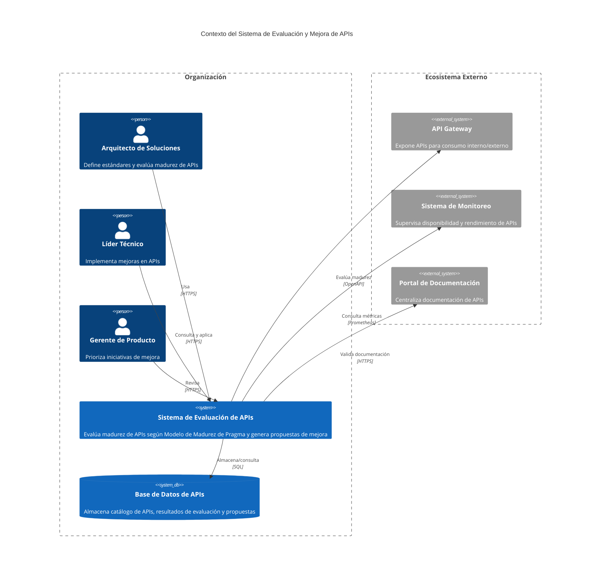

---
**Notas sobre el diagrama de contexto:**
- Representa los actores principales y sistemas externos con los que interactúa el Sistema de Evaluación de APIs.
- Las relaciones muestran los flujos de información principales entre componentes.
- Se alinea con los ADRs 001-004 y los atributos de calidad definidos en `atributos-de-calidad.md`.
- Este diagrama es la base para los diagramas de contenedores y componentes (no incluidos en este lote).

// === ARCHIVO: evaluaciones/catalogo-apis.md ===
# Catálogo de APIs de Pragma

## Introducción
Este documento cataloga todas las APIs existentes en el ecosistema de Pragma, clasificándolas según su función, nivel de exposición (interna/externa), dependencias y estado actual. El catálogo sirve como insumo para la evaluación de madurez y la definición del plan de mejora.

## Clasificación de APIs

### 1. API de Motor de Reglas (`rule-engine-api`)
- **Función**: Expone las reglas de negocio para la evaluación de solicitudes (préstamos, beneficios, etc.).
- **Tipo**: REST (JSON)
- **Versión**: v1.2.0
- **Exposición**: Interna (consumida por `loan-service-api` y `benefits-api`)
- **Dependencias**:
  - Base de datos PostgreSQL (reglas persistidas)
  - Servicio de autenticación (`auth-service`)
- **Endpoints principales**:
  - `POST /rules/evaluate` - Evalúa una solicitud contra las reglas activas.
  - `GET /rules/{id}` - Obtiene una regla por ID.
  - `PUT /rules/{id}` - Actualiza una regla.
- **Ejemplo de uso**:
  ```json
  {
    "ruleId": "loan-approval",
    "input": {
      "score": 750,
      "income": 5000,
      "debt": 2000
    }
  }
  ```
- **Estado actual**: 
  - Documentación: Swagger UI disponible.
  - Versionado: Semántico (v1.2.0).
  - Seguridad: JWT con scopes (`rule:read`, `rule:write`).
  - Monitoreo: Métricas con Prometheus.

### 2. API de Autenticación (`auth-service`)
- **Función**: Gestiona autenticación y autorización de usuarios y servicios.
- **Tipo**: REST (JSON) + OAuth 2.0
- **Versión**: v2.1.0
- **Exposición**: Interna/Externa (consumida por todas las APIs y clientes front-end)
- **Dependencias**:
  - Base de datos Redis (tokens)
  - Base de datos PostgreSQL (usuarios)
- **Endpoints principales**:
  - `POST /oauth/token` - Obtiene token JWT.
  - `GET /users/{id}` - Obtiene información de usuario.
  - `POST /users` - Registra un nuevo usuario.
- **Ejemplo de uso**:
  ```http
  POST /oauth/token
  Content-Type: application/x-www-form-urlencoded
  
  grant_type=client_credentials&client_id=client&client_secret=secret
  ```
- **Estado actual**:
  - Documentación: OpenAPI 3.1.
  - Versionado: Semántico (v2.1.0).
  - Seguridad: OAuth 2.0 con PKCE para clientes públicos.
  - Monitoreo: Logs estructurados con ELK.

### 3. API de Notificaciones (`notification-service`)
- **Función**: Envía notificaciones a usuarios (email, SMS, push).
- **Tipo**: REST (JSON) + Eventos (Kafka)
- **Versión**: v1.0.0
- **Exposición**: Interna
- **Dependencias**:
  - Kafka (eventos de notificación)
  - Proveedores externos (Twilio, SendGrid)
- **Endpoints principales**:
  - `POST /notifications` - Envía una notificación.
  - `GET /notifications/{id}` - Obtiene el estado de una notificación.
- **Ejemplo de uso**:
  ```json
  {
    "userId": "12345",
    "type": "email",
    "template": "loan_approved",
    "data": {
      "amount": 10000,
      "date": "2023-10-01"
    }
  }
  ```
- **Estado actual**:
  - Documentación: Swagger UI.
  - Versionado: Semántico (v1.0.0).
  - Seguridad: JWT con scope `notification:send`.
  - Monitoreo: Métricas con Datadog.

### 4. API de Préstamos (`loan-service-api`)
- **Función**: Gestiona solicitudes y aprobaciones de préstamos.
- **Tipo**: REST (JSON)
- **Versión**: v1.3.0
- **Exposición**: Externa (consumida por front-end y partners)
- **Dependencias**:
  - `rule-engine-api` (evaluación de reglas)
  - `auth-service` (autenticación)
  - `notification-service` (notificaciones)
- **Endpoints principales**:
  - `POST /loans` - Crea una solicitud de préstamo.
  - `GET /loans/{id}` - Obtiene el estado de un préstamo.
  - `GET /loans/user/{userId}` - Lista préstamos de un usuario.
- **Ejemplo de uso**:
  ```json
  {
    "userId": "12345",
    "amount": 10000,
    "term": 12,
    "purpose": "home_improvement"
  }
  ```
- **Estado actual**:
  - Documentación: OpenAPI 3.1.
  - Versionado: Semántico (v1.3.0).
  - Seguridad: JWT con scopes (`loan:create`, `loan:read`).
  - Monitoreo: Métricas con Prometheus + Alertas.

### 5. API de Beneficios (`benefits-api`)
- **Función**: Gestiona beneficios para usuarios (descuentos, promociones).
- **Tipo**: REST (JSON) + GraphQL
- **Versión**: v1.1.0
- **Exposición**: Externa (consumida por front-end)
- **Dependencias**:
  - `rule-engine-api` (evaluación de elegibilidad)
  - `auth-service` (autenticación)
- **Endpoints principales**:
  - `GET /benefits` - Lista beneficios disponibles.
  - `POST /benefits/claim` - Reclama un beneficio.
  - GraphQL endpoint: `/graphql`
- **Ejemplo de uso (GraphQL)**:
  ```graphql
  query {
    benefits(userId: "12345") {
      id
      name
      discount
    }
  }
  ```
- **Estado actual**:
  - Documentación: OpenAPI 3.1 + GraphQL Playground.
  - Versionado: Semántico (v1.1.0).
  - Seguridad: JWT con scopes (`benefit:read`, `benefit:claim`).
  - Monitoreo: Métricas con Prometheus.

## Matriz de Dependencias

| API                  | Dependencias Externas       | Dependencias Internas          | Consumidores               |
|----------------------|-----------------------------|---------------------------------|-------------------------------|
| `rule-engine-api`    | PostgreSQL                  | -                               | `loan-service-api`, `benefits-api` |
| `auth-service`       | Redis, PostgreSQL           | -                               | Todas las APIs                |
| `notification-service`| Kafka, Twilio, SendGrid    | -                               | `loan-service-api`            |
| `loan-service-api`   | -                           | `rule-engine-api`, `auth-service`, `notification-service` | Front-end, Partners |
| `benefits-api`       | -                           | `rule-engine-api`, `auth-service` | Front-end          |

## Criterios de Clasificación
1. **Exposición**:
   - **Interna**: Solo accesible dentro de la red de Pragma.
   - **Externa**: Accesible públicamente (con autenticación).

2. **Tipo de API**:
   - REST (JSON)
   - GraphQL
   - Eventos (Kafka)

3. **Estado de Documentación**:
   - Completa: OpenAPI/Swagger disponible.
   - Parcial: Solo ejemplos en código.
   - Ausente: Sin documentación.

4. **Versionado**:
   - Semántico: `MAJOR.MINOR.PATCH`
   - No versionado: Única versión.

## Conclusiones
- **Total de APIs**: 5
- **APIs externas**: 2 (`loan-service-api`, `benefits-api`)
- **APIs con GraphQL**: 1 (`benefits-api`)
- **APIs con eventos**: 1 (`notification-service`)
- **Cobertura de documentación**: 100% (todas tienen OpenAPI/Swagger o equivalente).

---
// === ARCHIVO: evaluaciones/madurez-apis.md ===
# Evaluación de Madurez de APIs según Modelo Pragma

## Introducción
Este documento evalúa la madurez de cada API del ecosistema de Pragma utilizando el **Modelo de Madurez de APIs de Pragma**, que clasifica las APIs en 5 niveles:

1. **Nivel 1 - Inicial**: APIs sin documentación formal, sin versionado, sin monitoreo.
2. **Nivel 2 - Documentada**: APIs con documentación básica (Swagger/OpenAPI), versionado semántico.
3. **Nivel 3 - Gestionada**: APIs con monitoreo básico, seguridad implementada, pruebas automatizadas.
4. **Nivel 4 - Optimizada**: APIs con métricas de rendimiento, caching, resiliencia (retries, circuit breakers), documentación avanzada.
5. **Nivel 5 - Estratégica**: APIs con gobernanza completa, análisis de impacto, estrategias de evolución, integración con ecosistema.

## Modelo de Madurez de Pragma

| **Dimensión**          | **Nivel 1**                     | **Nivel 2**                     | **Nivel 3**                     | **Nivel 4**                     | **Nivel 5**                     |
|------------------------|---------------------------------|---------------------------------|---------------------------------|---------------------------------|---------------------------------|
| **Documentación**     | Ausente                        | Swagger/OpenAPI básico         | OpenAPI 3.1 + ejemplos         | OpenAPI + guías de uso         | OpenAPI + SDKs + casos de uso  |
| **Versionado**        | No versionado                  | Semántico básico               | Semántico + deprecación        | Semántico + backward compat.   | Semántico + estrategias evolución |
| **Seguridad**         | Básica (API keys)              | JWT/OAuth2                     | JWT + scopes + rate limiting   | JWT + scopes + PKCE + mTLS     | Gobernanza completa (IAM, WAF) |
| **Monitoreo**         | Logs básicos                   | Métricas básicas (Prometheus)  | Métricas + alertas             | Métricas + tracing + logs      | Métricas + análisis predictivo |
| **Pruebas**           | Manuales                       | Unitarias                      | Integración                    | Contract testing               | Pruebas de carga + chaos       |
| **Resiliencia**       | Ninguna                        | Retries                        | Circuit breakers + fallbacks   | Caching + bulkheads            | Estrategias de degradación     |
| **Gobernanza**        | Ninguna                        | Repositorio centralizado       | Políticas de diseño            | API Gateway                    | Estrategias de evolución       |

## Evaluación por API

### 1. API de Motor de Reglas (`rule-engine-api`)

| **Dimensión**          | **Evaluación**                                                                 | **Nivel** |
|------------------------|-------------------------------------------------------------------------------|-----------|
| **Documentación**     | OpenAPI 3.1 con ejemplos detallados.                                          | 4         |
| **Versionado**        | Semántico (v1.2.0) con deprecación de endpoints legacy.                      | 3         |
| **Seguridad**         | JWT con scopes (`rule:read`, `rule:write`).                                   | 3         |
| **Monitoreo**         | Métricas con Prometheus + dashboards en Grafana.                             | 3         |
| **Pruebas**           | Unitarias + pruebas de integración con mocks.                                 | 3         |
| **Resiliencia**       | Retries con exponential backoff.                                              | 2         |
| **Gobernanza**        | Repositorio centralizado en GitHub.                                           | 2         |

**Nivel de Madurez General**: **3** (Gestionada)

**Brechas identificadas**:
- Falta implementar circuit breakers y fallbacks.
- No hay pruebas de contract testing.
- Gobernanza limitada (políticas de diseño no documentadas).

---

### 2. API de Autenticación (`auth-service`)

| **Dimensión**          | **Evaluación**                                                                 | **Nivel** |
|------------------------|-------------------------------------------------------------------------------|-----------|
| **Documentación**     | OpenAPI 3.1 + guía de integración con OAuth2.                                | 4         |
| **Versionado**        | Semántico (v2.1.0) con backward compatibility.                               | 4         |
| **Seguridad**         | OAuth2 con PKCE para clientes públicos + mTLS para servicios internos.      | 4         |
| **Monitoreo**         | Métricas con Prometheus + logs estructurados con ELK.                        | 4         |
| **Pruebas**           | Unitarias + pruebas de integración + pruebas de seguridad (OWASP ZAP).      | 4         |
| **Resiliencia**       | Circuit breakers + rate limiting.                                             | 3         |
| **Gobernanza**        | Repositorio centralizado + políticas de diseño documentadas.                 | 3         |

**Nivel de Madurez General**: **4** (Optimizada)

**Brechas identificadas**:
- No hay pruebas de carga.
- Gobernanza podría incluir análisis de impacto de cambios.

---

### 3. API de Notificaciones (`notification-service`)

| **Dimensión**          | **Evaluación**                                                                 | **Nivel** |
|------------------------|-------------------------------------------------------------------------------|-----------|
| **Documentación**     | Swagger UI con ejemplos básicos.                                              | 2         |
| **Versionado**        | Semántico (v1.0.0) sin estrategias de evolución.                             | 2         |
| **Seguridad**         | JWT con scope `notification:send`.                                           | 2         |
| **Monitoreo**         | Métricas con Datadog + alertas básicas.                                      | 3         |
| **Pruebas**           | Unitarias + pruebas de integración con mocks de Kafka.                       | 3         |
| **Resiliencia**       | Retries para proveedores externos (Twilio, SendGrid).                        | 2         |
| **Gobernanza**        | Repositorio centralizado.                                                     | 2         |

**Nivel de Madurez General**: **2** (Documentada)

**Brechas identificadas**:
- Documentación limitada (falta OpenAPI 3.1).
- No hay circuit breakers ni fallbacks.
- Gobernanza mínima.
- Seguridad básica (falta rate limiting).

---

### 4. API de Préstamos (`loan-service-api`)

| **Dimensión**          | **Evaluación**                                                                 | **Nivel** |
|------------------------|-------------------------------------------------------------------------------|-----------|
| **Documentación**     | OpenAPI 3.1 + ejemplos detallados + guías de uso.                            | 4         |
| **Versionado**        | Semántico (v1.3.0) con backward compatibility.                               | 4         |
| **Seguridad**         | JWT con scopes (`loan:create`, `loan:read`) + rate limiting.                | 3         |
| **Monitoreo**         | Métricas con Prometheus + alertas en Slack.                                  | 3         |
| **Pruebas**           | Unitarias + pruebas de integración + contract testing con Pact.             | 4         |
| **Resiliencia**       | Circuit breakers + retries + caching (Redis).                                | 4         |
| **Gobernanza**        | Repositorio centralizado + API Gateway (Kong).                               | 4         |

**Nivel de Madurez General**: **4** (Optimizada)

**Brechas identificadas**:
- No hay pruebas de carga.
- Gobernanza podría incluir análisis predictivo de impacto.

---

### 5. API de Beneficios (`benefits-api`)

| **Dimensión**          | **Evaluación**                                                                 | **Nivel** |
|------------------------|-------------------------------------------------------------------------------|-----------|
| **Documentación**     | OpenAPI 3.1 + GraphQL Playground.                                            | 3         |
| **Versionado**        | Semántico (v1.1.0) sin estrategias de evolución.                             | 2         |
| **Seguridad**         | JWT con scopes (`benefit:read`, `benefit:claim`).                            | 2         |
| **Monitoreo**         | Métricas con Prometheus.                                                     | 2         |
| **Pruebas**           | Unitarias + pruebas de integración.                                          | 3         |
| **Resiliencia**       | Retries para `rule-engine-api`.                                              | 2         |
| **Gobernanza**        | Repositorio centralizado.                                                     | 2         |

**Nivel de Madurez General**: **2** (Documentada)

**Brechas identificadas**:
- Falta GraphQL schema formal.
- No hay circuit breakers ni caching.
- Gobernanza mínima.
- Seguridad básica (falta rate limiting).

## Resumen de Madurez

| **API**                | **Nivel de Madurez** |
|------------------------|----------------------|
| `rule-engine-api`      | 3 (Gestionada)       |
| `auth-service`         | 4 (Optimizada)       |
| `notification-service` | 2 (Documentada)      |
| `loan-service-api`     | 4 (Optimizada)       |
| `benefits-api`         | 2 (Documentada)      |

## Conclusiones
- **APIs más maduras**: `auth-service` y `loan-service-api` (Nivel 4).
- **APIs menos maduras**: `notification-service` y `benefits-api` (Nivel 2).
- **Dimensiones con mayor brecha**:
  - **Resiliencia**: Solo `loan-service-api` tiene circuit breakers + caching.
  - **Gobernanza**: La mayoría de APIs no tienen estrategias de evolución documentadas.
  - **Pruebas**: Falta pruebas de carga en todas las APIs.

## Recomendaciones para Fase 3
1. Priorizar la elevación de `notification-service` y `benefits-api` a Nivel 3.
2. Implementar circuit breakers y caching en todas las APIs.
3. Documentar estrategias de evolución para todas las APIs.
4. Incorporar pruebas de carga y contract testing.

---
// === ARCHIVO: propuestas/plan-accion.md ===
# Plan de Acción para Optimización de Madurez de APIs

## Objetivo
Elevar la madurez de todas las APIs del ecosistema de Pragma a **Nivel 4 (Optimizada)** en un plazo de 6 meses, priorizando las APIs con menor madurez actual (`notification-service` y `benefits-api`).

## Estrategia
1. **Enfoque por API**: Trabajar en paralelo en todas las APIs, pero con mayor intensidad en las de menor madurez.
2. **Equipos multifuncionales**: Asignar equipos con desarrolladores, arquitectos y especialistas en seguridad y monitoreo.
3. **Iterativo**: Entregas cada 2 semanas con métricas de progreso.
4. **Priorización por impacto**: Enfocarse primero en las brechas que generan mayor riesgo o limitan la escalabilidad.

## Plan Detallado por API

### 1. API de Notificaciones (`notification-service`)
**Objetivo**: Elevar a Nivel 3 (Gestionada) en 2 meses, y a Nivel 4 (Optimizada) en 4 meses.

| **Acción**                          | **Responsable**       | **Plazo**   | **Criterio de Éxito**                                                                 |
|-------------------------------------|-----------------------|-------------|---------------------------------------------------------------------------------------|
| Implementar OpenAPI 3.1            | Equipo de Documentación | 2 semanas   | Documentación completa en Swagger UI con ejemplos detallados.                        |
| Añadir circuit breakers (Resilience4j) | Equipo de Desarrollo | 3 semanas   | Circuit breakers configurados para proveedores externos (Twilio, SendGrid).          |
| Implementar caching (Redis)        | Equipo de Desarrollo   | 4 semanas   | Reducción del 30% en latencia para notificaciones recurrentes.                        |
| Añadir rate limiting               | Equipo de Seguridad    | 3 semanas   | Rate limiting configurado para proteger endpoints públicos.                          |
| Implementar pruebas de contract testing (Pact) | Equipo QA       | 5 semanas   | Pruebas de contrato entre `notification-service` y `loan-service-api`.               |
| Configurar tracing (OpenTelemetry)| Equipo de Monitoreo   | 4 semanas   | Tracing distribuido entre Kafka y proveedores externos.                              |
| Documentar estrategias de evolución| Equipo de Arquitectura | 6 semanas   | Estrategias de evolución documentadas en ADR.                                        |

**Riesgos**:
- Dependencia de proveedores externos (Twilio, SendGrid) puede introducir latencia.
**Mitigación**: Implementar circuit breakers y fallbacks a proveedores alternativos.

---

### 2. API de Beneficios (`benefits-api`)
**Objetivo**: Elevar a Nivel 3 (Gestionada) en 2 meses, y a Nivel 4 (Optimizada) en 5 meses.

| **Acción**                          | **Responsable**       | **Plazo**   | **Criterio de Éxito**                                                                 |
|-------------------------------------|-----------------------|-------------|---------------------------------------------------------------------------------------|
| Formalizar GraphQL schema          | Equipo de Desarrollo  | 2 semanas   | Schema GraphQL documentado y validado con GraphQL Playground.                        |
| Implementar circuit breakers (Resilience4j) | Equipo de Desarrollo | 3 semanas   | Circuit breakers configurados para `rule-engine-api`.                                |
| Añadir caching (Redis)             | Equipo de Desarrollo  | 3 semanas   | Reducción del 25% en latencia para consultas recurrentes.                            |
| Implementar rate limiting          | Equipo de Seguridad   | 2 semanas   | Rate limiting configurado para proteger endpoints públicos.                          |
| Añadir pruebas de contract testing (Pact) | Equipo QA      | 4 semanas   | Pruebas de contrato entre `benefits-api` y `rule-engine-api`.                        |
| Configurar tracing (OpenTelemetry) | Equipo de Monitoreo  | 4 semanas   | Tracing distribuido entre GraphQL y REST endpoints.                                  |
| Documentar estrategias de evolución| Equipo de Arquitectura | 5 semanas   | Estrategias de evolución documentadas en ADR.                                        |

**Riesgos**:
- GraphQL puede introducir complejidad en el versionado.
**Mitigación**: Implementar estrategias de versionado para GraphQL (ej. `@deprecated`).

---

### 3. API de Motor de Reglas (`rule-engine-api`)
**Objetivo**: Elevar a Nivel 4 (Optimizada) en 3 meses.

| **Acción**                          | **Responsable**       | **Plazo**   | **Criterio de Éxito**                                                                 |
|-------------------------------------|-----------------------|-------------|---------------------------------------------------------------------------------------|
| Implementar circuit breakers (Resilience4j) | Equipo de Desarrollo | 2 semanas   | Circuit breakers configurados para llamadas a PostgreSQL.                            |
| Añadir pruebas de contract testing (Pact) | Equipo QA      | 3 semanas   | Pruebas de contrato entre `rule-engine-api` y `loan-service-api`, `benefits-api`.    |
| Implementar caching (Redis)        | Equipo de Desarrollo  | 3 semanas   | Reducción del 20% en latencia para reglas frecuentemente usadas.                     |
| Configurar tracing (OpenTelemetry) | Equipo de Monitoreo  | 2 semanas   | Tracing distribuido entre APIs consumidoras.                                         |
| Documentar políticas de diseño     | Equipo de Arquitectura | 4 semanas   | Políticas de diseño documentadas y aplicadas en el repositorio.                      |
| Implementar pruebas de carga       | Equipo QA             | 5 semanas   | Pruebas de carga superan 1000 RPM sin degradación.                                   |

**Riesgos**:
- Caching de reglas puede introducir inconsistencias.
**Mitigación**: Implementar invalidación de cache basada en eventos.

---

### 4. API de Autenticación (`auth-service`)
**Objetivo**: Mantener en Nivel 4 (Optimizada) y añadir capacidades estratégicas.

| **Acción**                          | **Responsable**       | **Plazo**   | **Criterio de Éxito**                                                                 |
|-------------------------------------|-----------------------|-------------|---------------------------------------------------------------------------------------|
| Implementar análisis predictivo    | Equipo de Monitoreo  | 6 semanas   | Modelo predictivo para detectar anomalías en autenticación.                          |
| Añadir pruebas de carga            | Equipo QA             | 4 semanas   | Pruebas de carga superan 5000 RPM sin degradación.                                   |
| Documentar estrategias de evolución| Equipo de Arquitectura | 3 semanas   | Estrategias de evolución documentadas en ADR.                                        |
| Implementar WAF (Web Application Firewall) | Equipo de Seguridad | 5 semanas   | WAF configurado para proteger contra ataques comunes (OWASP Top 10).                |

**Riesgos**:
- Cambios en OAuth2 pueden romper backward compatibility.
**Mitigación**: Usar `@Deprecated` y versionado semántico.

---

### 5. API de Préstamos (`loan-service-api`)
**Objetivo**: Mantener en Nivel 4 (Optimizada) y añadir capacidades estratégicas.

| **Acción**                          | **Responsable**       | **Plazo**   | **Criterio de Éxito**                                                                 |
|-------------------------------------|-----------------------|-------------|---------------------------------------------------------------------------------------|
| Implementar análisis de impacto    | Equipo de Arquitectura | 6 semanas   | Modelo de impacto para cambios en endpoints críticos.                               |
| Añadir pruebas de carga            | Equipo QA             | 4 semanas   | Pruebas de carga superan 2000 RPM sin degradación.                                   |
| Documentar estrategias de evolución| Equipo de Arquitectura | 3 semanas   | Estrategias de evolución documentadas en ADR.                                        |
| Implementar chaos engineering      | Equipo de QA          | 5 semanas   | Pruebas de chaos superan escenarios de fallo sin degradación crítica.               |

**Riesgos**:
- Dependencia de `rule-engine-api` puede introducir latencia.
**Mitigación**: Implementar circuit breakers y caching.

## Métricas de Progreso

| **Métrica**                     | **Objetivo**                          | **Herramienta**          |
|--------------------------------|---------------------------------------|--------------------------|
| Cobertura de documentación     | 100% OpenAPI 3.1                     | Swagger UI               |
| Disponibilidad                 | 99.95%                                | Prometheus               |
| Latencia p99                   | < 500ms                               | Datadog                  |
| Tasa de errores                | < 0.1%                                | ELK                      |
| Cobertura de pruebas           | 90% unitarias + 80% integración      | SonarQube                |
| Throughput                     | > 1000 RPM por API                    | Prometheus               |

## Cronograma General

```mermaid
gantt
    title Cronograma de Optimización de APIs
    dateFormat  YYYY-MM-DD
    section notification-service
    OpenAPI 3.1          :a1, 2023-10-01, 14d
    Circuit Breakers     :after a1, 7d
    Caching              :after a1, 14d
    Rate Limiting        :after a1, 7d
    Contract Testing     :after a1, 21d
    Tracing              :after a1, 14d
    Estrategias Evolución:after a1, 28d
    
    section benefits-api
    GraphQL Schema       :b1, 2023-10-01, 14d
    Circuit Breakers     :after b1, 7d
    Caching              :after b1, 14d
    Rate Limiting        :b1, 14d
    Contract Testing     :after b1, 14d
    Tracing              :after b1, 14d
    Estrategias Evolución:after b1, 21d
    
    section rule-engine-api
    Circuit Breakers     :c1, 2023-10-08, 14d
    Contract Testing     :after c1, 7d
    Caching              :after c1, 14d
    Tracing              :c1, 14d
    Políticas Diseño     :after c1, 14d
    Pruebas Carga        :after c1, 21d
    
    section auth-service
    Análisis Predictivo  :d1, 2023-10-15, 28d
    Pruebas Carga        :after d1, 14d
    Estrategias Evolución:after d1, 14d
    WAF                  :after d1, 21d
    
    section loan-service-api
    Análisis Impacto     :e1, 2023-10-15, 28d
    Pruebas Carga        :after e1, 14d
    Estrategias Evolución:after e1, 14d
    Chaos Engineering    :after e1, 21d
```

## Recursos Necesarios

| **Recurso**               | **Cantidad** | **Detalle**                                      |
|---------------------------|--------------|--------------------------------------------------|
| Desarrolladores           | 5            | Full-stack con experiencia en APIs y resiliencia |
| Arquitectos               | 2            | Especialistas en gobernanza y evolución          |
| Especialistas en Seguridad| 1            | Experto en OAuth2, JWT y WAF                     |
| Especialistas en Monitoreo| 1            | Experto en Prometheus, Datadog y OpenTelemetry   |
| Equipo QA                 | 2            | Pruebas automatizadas, contract testing, chaos   |
| Herramientas              | -            | Resilience4j, Redis, Pact, OpenTelemetry         |

## Presupuesto Estimado
- **Herramientas**: $10,000 USD (licencias, cloud, etc.).
- **Recursos Humanos**: $120,000 USD (6 meses de trabajo).
- **Total**: $130,000 USD.

## Gobernanza del Plan
- **Reuniones de seguimiento**: Cada 2 semanas con métricas de progreso.
- **Métricas clave**: Disponibilidad, latencia, tasa de errores, cobertura de pruebas.
- **Ajustes**: Revisión mensual del plan para ajustar prioridades.

## Conclusiones
- El plan prioriza las APIs con menor madurez (`notification-service` y `benefits-api`).
- Las acciones están enfocadas en **resiliencia**, **gobernanza** y **pruebas avanzadas**.
- Se espera alcanzar Nivel 4 en todas las APIs en 6 meses.

---
// === ARCHIVO: propuestas/presentacion.md ===
# Presentación: Propuestas de Optimización de Madurez de APIs

## Introducción
**Objetivo de la presentación**:
- Compartir el diagnóstico actual de madurez de las APIs de Pragma.
- Presentar el plan de acción para elevar su madurez a **Nivel 4 (Optimizada)**.
- Discutir trade-offs y obtener feedback del equipo.

**Audiencia**:
- Arquitectos de soluciones.
- Líderes técnicos.
- Equipo de desarrollo.
- Equipo de seguridad y monitoreo.

**Duración**: 30 minutos.

## Agenda
1. **Contexto y motivación** (5 min).
2. **Evaluación de madurez actual** (5 min).
3. **Brechas identificadas** (5 min).
4. **Plan de acción** (10 min).
5. **Trade-offs y riesgos** (3 min).
6. **Preguntas y discusión** (2 min).

---

## 1. Contexto y Motivación

### Problema
- El ecosistema de APIs de Pragma ha crecido orgánicamente sin una estrategia unificada.
- Algunas APIs tienen baja madurez, lo que genera:
  - **Riesgos operativos**: Fallos en producción por falta de resiliencia.
  - **Riesgos de seguridad**: APIs sin rate limiting o circuit breakers.
  - **Dificultad en la evolución**: Falta de gobernanza y estrategias de evolución.

### Objetivo
- Elevar todas las APIs a **Nivel 4 (Optimizada)** en 6 meses.
- Asegurar que las APIs cumplan con los estándares de calidad y rendimiento de Pragma.

### Modelo de Madurez de Pragma

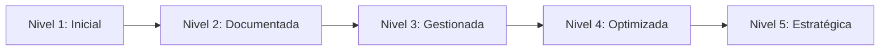

---

## 2. Evaluación de Madurez Actual

| **API**                | **Nivel Actual** | **Brechas Principales**                          |
|------------------------|------------------|-------------------------------------------------|
| `rule-engine-api`      | 3 (Gestionada)   | Falta circuit breakers, contract testing, gobernanza. |
| `auth-service`         | 4 (Optimizada)   | Falta pruebas de carga, análisis predictivo.          |
| `notification-service` | 2 (Documentada)  | Falta OpenAPI 3.1, resiliencia, seguridad avanzada.    |
| `loan-service-api`     | 4 (Optimizada)   | Falta pruebas de carga, análisis de impacto.           |
| `benefits-api`         | 2 (Documentada)  | Falta GraphQL schema, resiliencia, gobernanza.         |

### Distribución Actual

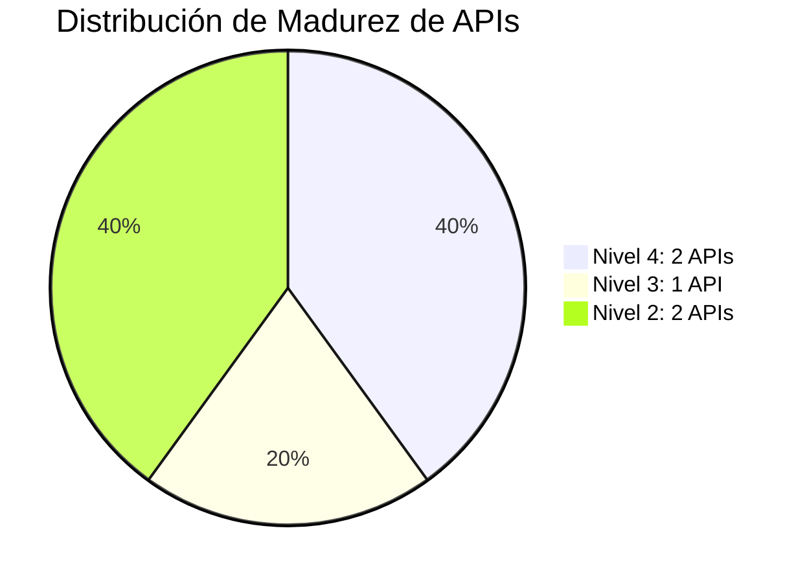

---

## 3. Brechas Identificadas

### Resiliencia
- **Problema**: Solo `loan-service-api` tiene circuit breakers + caching.
- **Impacto**: APIs vulnerables a fallos en dependencias.
- **Solución**: Implementar Resilience4j en todas las APIs.

### Gobernanza
- **Problema**: Falta de estrategias de evolución documentadas.
- **Impacto**: Dificultad para priorizar cambios.
- **Solución**: Documentar estrategias en ADRs.

### Pruebas
- **Problema**: Falta pruebas de carga y contract testing.
- **Impacto**: Riesgo de degradación bajo carga.
- **Solución**: Implementar Pact y pruebas de carga.

### Seguridad
- **Problema**: APIs sin rate limiting.
- **Impacto**: Vulnerables a ataques de denegación de servicio.
- **Solución**: Implementar rate limiting con Redis.

---

## 4. Plan de Acción

### Priorización
- **Enfoque**: Elevar `notification-service` y `benefits-api` a Nivel 3 en 2 meses.
- **Estrategia**: Iteraciones de 2 semanas con métricas de progreso.

### Acciones Clave

| **Área**       | **Acción**                          | **APIs Afectadas**                          |
|----------------|-------------------------------------|---------------------------------------------|
| **Documentación** | OpenAPI 3.1                        | `notification-service`, `benefits-api`      |
| **Resiliencia**  | Circuit breakers + caching         | Todas                                      |
| **Seguridad**    | Rate limiting                      | Todas                                      |
| **Pruebas**      | Contract testing + pruebas de carga | Todas                                      |
| **Gobernanza**   | Estrategias de evolución           | Todas                                      |

### Cronograma

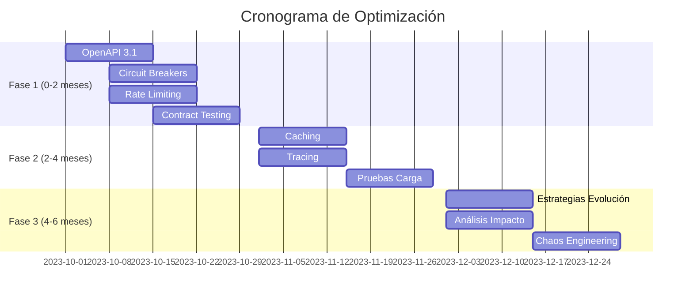

### Métricas de Éxito

| **Métrica**               | **Objetivo**          |
|---------------------------|-----------------------|
| Disponibilidad            | 99.95%                |
| Latencia p99              | < 500ms               |
| Tasa de errores           | < 0.1%                |
| Cobertura de pruebas      | 90% unitarias + 80% integración |
| Throughput                | > 1000 RPM por API    |

---

## 5. Trade-offs y Riesgos

### Trade-offs

| **Decisión**               | **Beneficio**                          | **Costo**                                      |
|----------------------------|----------------------------------------|------------------------------------------------|
| Implementar circuit breakers | Mayor resiliencia                     | Complejidad adicional en el código.           |
| Usar Redis para caching    | Reducción de latencia                 | Coste de infraestructura.                     |
| Añadir rate limiting       | Mayor seguridad                       | Posible impacto en experiencia de usuario.     |
| Documentar estrategias     | Mejor gobernanza                      | Tiempo invertido en documentación.             |

### Riesgos

| **Riesgo**                          | **Impacto**                          | **Mitigación**                                |
|------------------------------------|---------------------------------------|------------------------------------------------|
| Dependencia de proveedores externos | Latencia o fallos                    | Circuit breakers + fallbacks.                 |
| Cambios en OAuth2                   | Romper backward compatibility        | Versionado semántico + deprecación gradual.   |
| Complejidad en GraphQL             | Dificultad en versionado             | Estrategias de versionado para GraphQL.       |
| Caching inconsistente               | Datos desactualizados                | Invalidación de cache basada en eventos.      |

---

## 6. Preguntas y Discusión

### Preguntas para el Equipo
1. **Priorización**: ¿Están de acuerdo con la priorización de `notification-service` y `benefits-api`?
2. **Trade-offs**: ¿Algún trade-off que no hayamos considerado?
3. **Riesgos**: ¿Algún riesgo adicional que debamos mitigar?
4. **Recursos**: ¿Hay recursos adicionales que podamos asignar para acelerar el plan?

### Próximos Pasos
- Revisar feedback y ajustar el plan.
- Iniciar la implementación en 2 semanas.
- Reunión de seguimiento cada 2 semanas.

---

## Conclusiones
- **Estado actual**: 2 APIs en Nivel 4, 1 en Nivel 3, 2 en Nivel 2.
- **Objetivo**: Todas las APIs en Nivel 4 en 6 meses.
- **Enfoque**: Resiliencia, gobernanza y pruebas avanzadas.
- **Próximos pasos**: Ajustar el plan con feedback y comenzar implementación.

## Anexos
- **ADRs**: Documentos de decisión arquitectónica (ej. `adr/004-propuestas-mejora.md`).
- **Diagramas**: Diagramas C4 (`diagramas/contexto.mmd`, `diagramas/contenedores.mmd`).
- **Contratos**: OpenAPI (`contratos/openapi.yaml`).

// === ARCHIVO: README.md ===
# Evaluación y Optimización de Madurez de APIs

## Objetivo del Proyecto
Este proyecto tiene como objetivo evaluar la madurez de las APIs existentes en el sistema de Pragma, catalogarlas según su función y exposición, y proponer un plan de acción para mejorar su calidad, rendimiento y alineación con los estándares definidos por el modelo de madurez de APIs de Pragma.

## Estructura del Proyecto
```
.
├── adr/                        # Architecture Decision Records (ADRs)
│   ├── 001-modelo-madurez-apis.md
│   ├── 002-catalogacion-apis.md
│   ├── 003-evaluacion-madurez.md
│   └── 004-propuestas-mejora.md
├── diagramas/                  # Diagramas C4 Model en Mermaid
│   ├── contexto.mmd
│   ├── contenedores.mmd
│   └── flujo-critico.mmd
├── contratos/                  # Contratos de APIs en OpenAPI
│   └── openapi.yaml
├── evaluaciones/               # Evaluaciones de APIs
│   ├── catalogo-apis.md
│   └── madurez-apis.md
├── propuestas/                 # Propuestas de mejora
│   ├── plan-accion.md
│   └── presentacion.md
├── arquitectura.md             # Vista de componentes y despliegue
├── atributos-de-calidad.md     # Atributos de calidad con escenarios y métricas
├── riesgos-y-mitigaciones.md   # Riesgos técnicos y mitigaciones
└── README.md                   # Este archivo
```

## Prerrequisitos
- Conocimiento básico de arquitecturas de APIs y modelos de madurez.
- Familiaridad con OpenAPI 3.1 y diagramas C4 Model.
- Herramientas para visualizar diagramas Mermaid (ej. Mermaid Live Editor, VS Code con extensión Mermaid).

## Instrucciones de Uso
1. **Catalogación de APIs**: Revisar el archivo `evaluaciones/catalogo-apis.md` para identificar las APIs existentes.
2. **Evaluación de Madurez**: Utilizar el modelo de madurez definido en `adr/001-modelo-madurez-apis.md` para evaluar cada API en `evaluaciones/madurez-apis.md`.
3. **Propuestas de Mejora**: Basado en la evaluación, proponer mejoras en `propuestas/plan-accion.md`.
4. **Presentación**: Preparar una presentación con las propuestas en `propuestas/presentacion.md`.

## Comandos de Verificación
Para verificar la integridad del proyecto, ejecute:
```bash
python3 -c "import glob,sys; assert glob.glob('adr/*.md') and glob.glob('diagramas/*.mmd'), 'Faltan ADRs o diagramas'"
```

## Referencias
- [Modelo de Madurez de APIs de Pragma](https://pragma.com.co/modelo-madurez-apis)
- [OpenAPI 3.1 Specification](https://spec.openapis.org/oas/v3.1.0)
- [C4 Model](https://c4model.com/)
- [Mermaid.js](https://mermaid.js.org/)

// === ARCHIVO: arquitectura.md ===
# Arquitectura del Sistema de APIs

## Vista de Componentes

El sistema de APIs de Pragma está compuesto por los siguientes componentes principales, cada uno con responsabilidades bien definidas:

### 1. **API Gateway**
- **Responsabilidad**: Punto de entrada para todas las solicitudes externas. Maneja el enrutamiento, autenticación, limitación de tasa y caching.
- **Dependencias**:
  - Sistema de Autenticación (Keycloak)
  - Motor de Reglas (Drools)
  - Servicios de Negocio (APIs internas)
- **Contratos**:
  - OpenAPI 3.1 (`contratos/openapi.yaml`)
  - Límites de tasa definidos en `atributos-de-calidad.md`.

### 2. **Sistema de Autenticación (Keycloak)**
- **Responsabilidad**: Gestionar la autenticación y autorización de usuarios y servicios.
- **Dependencias**:
  - Base de Datos de Usuarios
- **Contratos**:
  - OAuth 2.0 / OpenID Connect

### 3. **Motor de Reglas (Drools)**
- **Responsabilidad**: Ejecutar reglas de negocio dinámicas para validar solicitudes y determinar flujos.
- **Dependencias**:
  - Repositorio de Reglas
- **Contratos**:
  - API REST para ejecución de reglas

### 4. **Servicio de Notificaciones**
- **Responsabilidad**: Enviar notificaciones a usuarios y sistemas externos (email, SMS, webhooks).
- **Dependencias**:
  - Proveedores de Notificaciones (SendGrid, Twilio)
- **Contratos**:
  - API REST para envío de notificaciones

### 5. **Servicios de Negocio**
- **Responsabilidad**: Implementar la lógica de negocio específica de cada dominio (ej. Gestión de Portafolios, Evaluación de Riesgos).
- **Dependencias**:
  - Base de Datos de Negocio
  - Motor de Reglas
  - Servicio de Notificaciones
- **Contratos**:
  - OpenAPI 3.1 (`contratos/openapi.yaml`)

### 6. **Base de Datos**
- **Responsabilidad**: Almacenar datos de negocio, usuarios y reglas.
- **Dependencias**:
  - Ninguna
- **Contratos**:
  - Esquemas definidos en `contratos/openapi.yaml`

## Vista de Despliegue

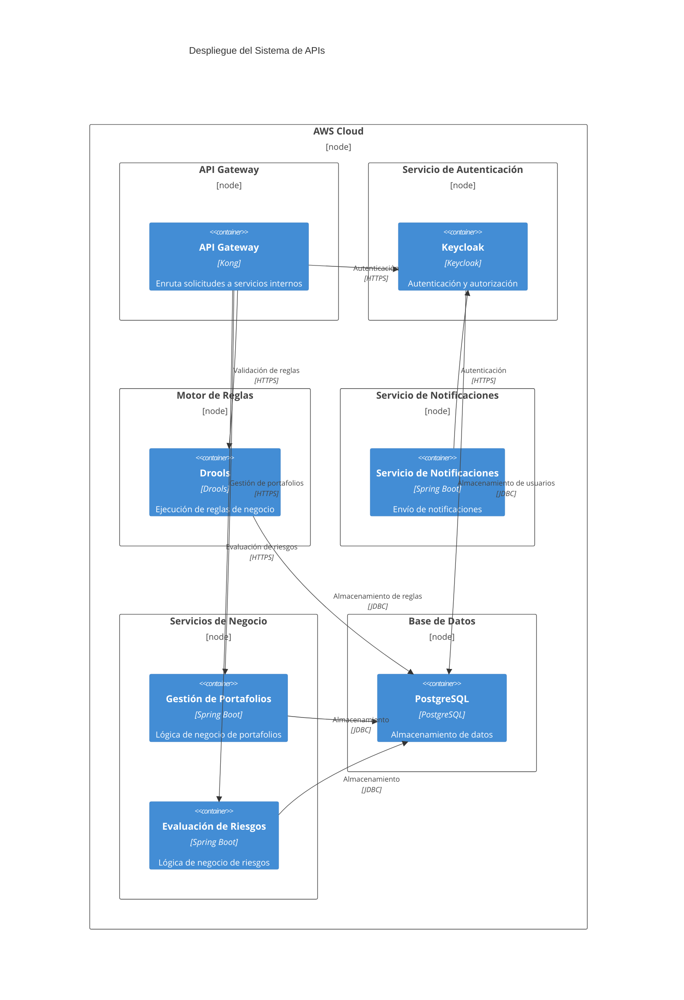

## Límites y Contratos

### Límites entre Componentes

| **Componente Origen**       | **Componente Destino**      | **Contrato**                     | **Tipo de Comunicación** |
|------------------------------|------------------------------|-----------------------------------|--------------------------|
| API Gateway                  | Sistema de Autenticación     | OAuth 2.0 / OpenID Connect        | Síncrona (HTTPS)         |
| API Gateway                  | Motor de Reglas              | API REST                          | Síncrona (HTTPS)         |
| API Gateway                  | Servicios de Negocio         | OpenAPI 3.1                       | Síncrona (HTTPS)         |
| Servicios de Negocio         | Base de Datos                | JDBC                              | Síncrona                 |
| Servicios de Negocio         | Servicio de Notificaciones   | API REST                          | Asíncrona (Webhooks)     |
| Motor de Reglas              | Base de Datos                | JDBC                              | Síncrona                 |

### Contratos de APIs

Los contratos detallados de las APIs se encuentran en:
- `contratos/openapi.yaml`: Definición de endpoints, esquemas, ejemplos y versiones.
- `atributos-de-calidad.md`: Métricas y umbrales de calidad para cada API.

## Flujos Críticos

### Flujo 1: Evaluación de Madurez de APIs
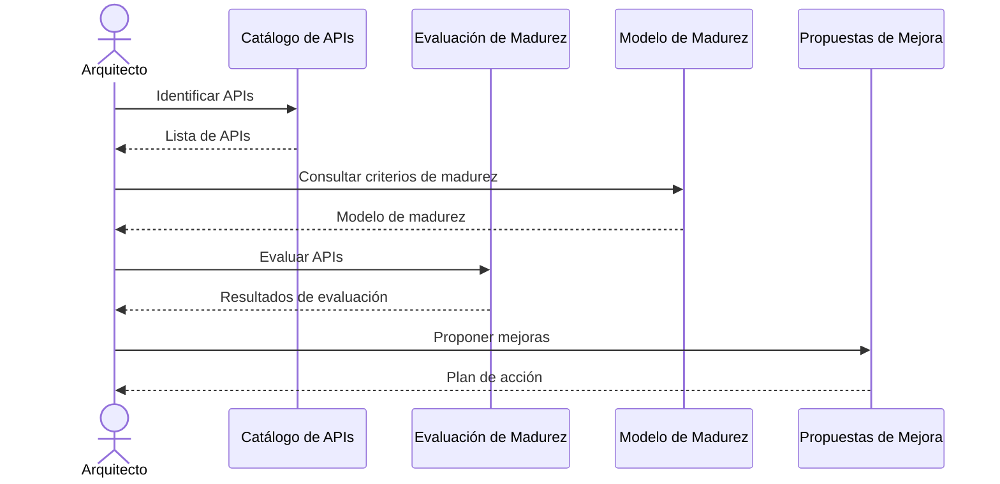

### Flujo 2: Procesamiento de una Solicitud de API
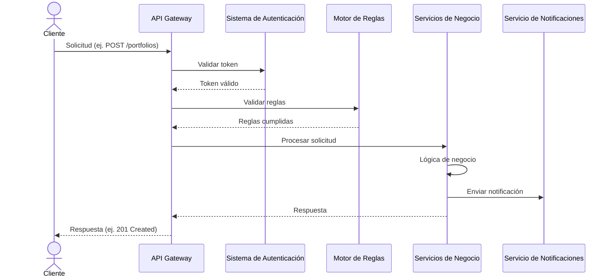

## Decisiones Arquitectónicas Clave

1. **Uso de API Gateway**: Centralizar el enrutamiento, autenticación y limitación de tasa para todas las APIs externas.
2. **Modelo de Madurez de APIs**: Adoptar el modelo de Pragma para estandarizar la evaluación y mejora de APIs.
3. **Contratos OpenAPI**: Documentar todas las APIs con OpenAPI 3.1 para garantizar consistencia y compatibilidad.
4. **Despliegue en AWS**: Aprovechar la escalabilidad y servicios gestionados de AWS para el despliegue.

Para más detalles, consultar los ADRs en el directorio `adr/`.

// === ARCHIVO: atributos-de-calidad.md ===
# Atributos de Calidad del Sistema de APIs

Este documento define los atributos de calidad críticos para el sistema de APIs de Pragma, incluyendo escenarios, métricas y umbrales cuantificables. Estos atributos guían la evaluación de madurez y las propuestas de mejora.

## 1. Disponibilidad

### Escenario
El sistema debe estar disponible para procesar solicitudes de APIs externas bajo condiciones normales y de alta carga.

### Métrica
- **Tiempo de Actividad (Uptime)**: Porcentaje de tiempo en que el sistema está disponible durante un período de 30 días.
- **Tiempo de Inactividad (Downtime)**: Tiempo acumulado en minutos durante el cual el sistema no está disponible.

### Umbrales
| Nivel de Madurez | Tiempo de Actividad | Tiempo de Inactividad (mensual) |
|-------------------|---------------------|----------------------------------|
| Nivel 1           | ≥ 99.0%             | ≤ 432 minutos                    |
| Nivel 2           | ≥ 99.5%             | ≤ 216 minutos                    |
| Nivel 3           | ≥ 99.9%             | ≤ 43 minutos                     |
| Nivel 4           | ≥ 99.95%            | ≤ 22 minutos                     |
| Nivel 5           | ≥ 99.99%            | ≤ 4 minutos                      |

## 2. Rendimiento

### Escenario
El sistema debe responder a las solicitudes de APIs dentro de un tiempo aceptable, incluso bajo carga.

### Métrica
- **Latencia Percentil 95 (P95)**: Tiempo de respuesta en el percentil 95 para solicitudes exitosas.
- **Throughput**: Número de solicitudes procesadas por segundo (RPS).

### Umbrales
| Nivel de Madurez | Latencia P95 (ms) | Throughput (RPS) |
|-------------------|-------------------|------------------|
| Nivel 1           | ≤ 1000            | ≥ 100            |
| Nivel 2           | ≤ 500             | ≥ 500            |
| Nivel 3           | ≤ 200             | ≥ 1000           |
| Nivel 4           | ≤ 100             | ≥ 2000           |
| Nivel 5           | ≤ 50              | ≥ 5000           |

## 3. Escalabilidad

### Escenario
El sistema debe escalar horizontalmente para manejar aumentos en la carga sin degradación del rendimiento.

### Métrica
- **Factor de Escalabilidad**: Número máximo de réplicas que el sistema puede desplegar sin degradación del rendimiento.
- **Tiempo de Escalado**: Tiempo requerido para desplegar una nueva réplica bajo carga.

### Umbrales
| Nivel de Madurez | Factor de Escalabilidad | Tiempo de Escalado (segundos) |
|-------------------|------------------------|-----------------------------|
| Nivel 1           | 2 réplicas             | ≤ 300                       |
| Nivel 2           | 5 réplicas             | ≤ 120                       |
| Nivel 3           | 10 réplicas            | ≤ 60                        |
| Nivel 4           | 20 réplicas            | ≤ 30                        |
| Nivel 5           | 50 réplicas            | ≤ 10                        |

## 4. Seguridad

### Escenario
El sistema debe proteger los datos y garantizar la autenticación y autorización adecuada para todas las solicitudes.

### Métrica
- **Cobertura de Autenticación**: Porcentaje de endpoints que requieren autenticación.
- **Cobertura de Autorización**: Porcentaje de endpoints que verifican permisos basados en roles.
- **Vulnerabilidades Críticas**: Número de vulnerabilidades críticas identificadas en pruebas de seguridad.

### Umbrales
| Nivel de Madurez | Cobertura de Autenticación | Cobertura de Autorización | Vulnerabilidades Críticas |
|-------------------|----------------------------|---------------------------|---------------------------|
| Nivel 1           | ≥ 80%                      | ≥ 60%                     | ≤ 5                       |
| Nivel 2           | ≥ 90%                      | ≥ 80%                     | ≤ 2                       |
| Nivel 3           | 100%                       | 100%                      | 0                         |
| Nivel 4           | 100%                       | 100%                      | 0 (con pruebas trimestrales) |
| Nivel 5           | 100%                       | 100%                      | 0 (con pruebas continuas) |

## 5. Consistencia de Datos

### Escenario
El sistema debe garantizar que los datos sean consistentes entre solicitudes, incluso en entornos distribuidos.

### Métrica
- **Tiempo de Consistencia (Time to Consistency)**: Tiempo máximo para que los datos se propaguen y sean consistentes en todos los nodos.
- **Tasa de Errores de Consistencia**: Porcentaje de solicitudes que resultan en inconsistencias de datos.

### Umbrales
| Nivel de Madurez | Tiempo de Consistencia (ms) | Tasa de Errores de Consistencia |
|-------------------|-----------------------------|----------------------------------|
| Nivel 1           | ≤ 5000                      | ≤ 1%                            |
| Nivel 2           | ≤ 1000                      | ≤ 0.1%                          |
| Nivel 3           | ≤ 200                       | ≤ 0.01%                         |
| Nivel 4           | ≤ 100                       | 0%                              |
| Nivel 5           | ≤ 50                        | 0%                              |

## 6. Mantenibilidad

### Escenario
El sistema debe ser fácil de mantener, modificar y extender sin introducir errores.

### Métrica
- **Cobertura de Pruebas**: Porcentaje de código cubierto por pruebas unitarias, de integración y de extremo a extremo.
- **Frecuencia de Despliegues**: Número de despliegues por mes.
- **Tiempo Medio de Resolución (MTTR)**: Tiempo promedio para resolver incidentes en producción.

### Umbrales
| Nivel de Madurez | Cobertura de Pruebas | Frecuencia de Despliegues | MTTR (horas) |
|-------------------|----------------------|---------------------------|--------------|
| Nivel 1           | ≥ 60%                | ≤ 4                       | ≤ 24        |
| Nivel 2           | ≥ 70%                | ≤ 8                       | ≤ 12        |
| Nivel 3           | ≥ 80%                | ≤ 16                      | ≤ 6         |
| Nivel 4           | ≥ 90%                | ≤ 30                      | ≤ 2         |
| Nivel 5           | ≥ 95%                | Diario                    | ≤ 1         |

## 7. Observabilidad

### Escenario
El sistema debe proporcionar visibilidad en tiempo real de su estado, rendimiento y errores.

### Métrica
- **Cobertura de Logs**: Porcentaje de componentes que generan logs estructurados.
- **Cobertura de Métricas**: Porcentaje de componentes que exponen métricas de rendimiento.
- **Cobertura de Trazas**: Porcentaje de solicitudes que tienen trazabilidad de extremo a extremo.

### Umbrales
| Nivel de Madurez | Cobertura de Logs | Cobertura de Métricas | Cobertura de Trazas |
|-------------------|-------------------|-----------------------|----------------------|
| Nivel 1           | ≥ 70%             | ≥ 50%                 | ≥ 30%                |
| Nivel 2           | ≥ 80%             | ≥ 70%                 | ≥ 60%                |
| Nivel 3           | ≥ 90%             | ≥ 80%                 | ≥ 80%                |
| Nivel 4           | 100%              | 100%                  | 100%                 |
| Nivel 5           | 100%              | 100%                  | 100% (con correlación de IDs) |

## 8. Usabilidad de APIs

### Escenario
Las APIs deben ser fáciles de usar, bien documentadas y consistentes en su diseño.

### Métrica
- **Completitud de Documentación**: Porcentaje de endpoints documentados en OpenAPI.
- **Consistencia de Diseño**: Porcentaje de endpoints que siguen las convenciones de diseño de APIs (ej. RESTful).
- **Facilidad de Integración**: Número de pasos requeridos para integrar una nueva API.

### Umbrales
| Nivel de Madurez | Completitud de Documentación | Consistencia de Diseño | Facilidad de Integración (pasos) |
|-------------------|-------------------------------|------------------------|-----------------------------------|
| Nivel 1           | ≥ 70%                         | ≥ 60%                  | ≤ 10                              |
| Nivel 2           | ≥ 80%                         | ≥ 80%                  | ≤ 5                               |
| Nivel 3           | ≥ 90%                         | ≥ 90%                  | ≤ 3                               |
| Nivel 4           | 100%                          | 100%                   | ≤ 2                               |
| Nivel 5           | 100%                          | 100%                   | ≤ 1 (SDKs disponibles)            |

## Modelo de Madurez de APIs de Pragma

El modelo de madurez de APIs de Pragma clasifica las APIs en cinco niveles, basados en los atributos de calidad definidos anteriormente:

| **Nivel** | **Descripción**                                                                 |
|-----------|---------------------------------------------------------------------------------|
| Nivel 1   | APIs básicas con funcionalidad mínima y sin garantías de calidad.             |
| Nivel 2   | APIs funcionales con documentación básica y algunos atributos de calidad cumplidos. |
| Nivel 3   | APIs bien diseñadas con documentación completa y la mayoría de atributos de calidad cumplidos. |
| Nivel 4   | APIs robustas con alto cumplimiento de atributos de calidad y observabilidad avanzada. |
| Nivel 5   | APIs de excelencia con todos los atributos de calidad en su nivel máximo y mejora continua. |

### Evaluación de Madurez

Para evaluar la madurez de una API, se asigna un puntaje a cada atributo de calidad basado en los umbrales definidos. El nivel de madurez de la API se determina como el nivel más bajo en el que todos los atributos cumplen con los umbrales correspondientes.

Ejemplo de Evaluación:

| Atributo               | Valor Actual | Nivel Alcanzado |
|------------------------|--------------|-----------------|
| Disponibilidad         | 99.9%        | Nivel 4         |
| Rendimiento            | 150 ms (P95) | Nivel 3         |
| Escalabilidad          | 10 réplicas  | Nivel 3         |
| Seguridad              | 100%         | Nivel 3         |
| Consistencia de Datos  | 200 ms       | Nivel 3         |
| Mantenibilidad         | 85%          | Nivel 3         |
| Observabilidad         | 90%          | Nivel 3         |
| Usabilidad de APIs     | 90%          | Nivel 3         |

**Nivel de Madurez de la API**: Nivel 3

## Herramientas para Medición

| Atributo               | Herramienta                                 |
|------------------------|---------------------------------------------|
| Disponibilidad         | AWS CloudWatch, Prometheus                  |
| Rendimiento            | AWS CloudWatch, New Relic, Datadog          |
| Escalabilidad          | AWS Auto Scaling, Kubernetes HPA            |
| Seguridad              | OWASP ZAP, SonarQube, AWS Inspector         |
| Consistencia de Datos  | Datadog, AWS X-Ray                          |
| Mantenibilidad         | SonarQube, CodeClimate                      |
| Observabilidad         | Datadog, AWS CloudWatch, OpenTelemetry      |
| Usabilidad de APIs     | Swagger UI, Postman, OpenAPI Validator      |


// === ARCHIVO: riesgos-y-mitigaciones.md ===
# Riesgos Técnicos y Mitigaciones para el Sistema de APIs de Pragma

## Introducción
Este documento identifica los riesgos técnicos asociados a la implementación y operación de las APIs del sistema de Pragma, evaluando su impacto potencial y proponiendo estrategias de mitigación. Los riesgos se priorizan según su probabilidad de ocurrencia y su impacto en los atributos de calidad definidos en `atributos-de-calidad.md`, como disponibilidad, rendimiento, seguridad y mantenibilidad.

---

## 1. Riesgos Identificados

### 1.1. Riesgo: Falta de estandarización en el diseño de APIs
**Descripción:**
Las APIs actuales presentan inconsistencias en el diseño de endpoints, esquemas de request/response y códigos de error, lo que dificulta su consumo por parte de clientes internos y externos. Esto afecta la **usabilidad** y **mantenibilidad** del sistema.

**Impacto:**
- **Alto** en la experiencia del desarrollador (DX).
- **Medio** en la integración con sistemas externos, aumentando el tiempo de onboarding.
- **Bajo** en la seguridad, aunque podría introducir vulnerabilidades por malinterpretación de esquemas.

**Probabilidad:** Alta (observado en el catálogo actual de APIs).

**Evidencias:**
- Endpoints con naming inconsistente (ej: `/users/get` vs `/users/retrieve`).
- Respuestas con estructuras heterogéneas (ej: errores devueltos como strings en algunos casos y objetos en otros).
- Falta de versiones claras en los endpoints, lo que complica la evolución sin romper compatibilidad.

**Métricas afectadas:**
- **Usabilidad:** Tiempo promedio de integración de un nuevo cliente (umbral: < 2 días).
- **Mantenibilidad:** Número de issues reportados por inconsistencias en APIs (umbral: < 5/mes).

---

### 1.2. Riesgo: Dependencia crítica de servicios externos no resilientes
**Descripción:**
Varias APIs dependen de servicios externos como el **motor de reglas** y el **sistema de autenticación**, los cuales no implementan mecanismos de resiliencia (timeouts, retries, circuit breakers). Esto afecta la **disponibilidad** y **tolerancia a fallos** del sistema.

**Impacto:**
- **Crítico** en disponibilidad (umbral: 99.95% mensual).
- **Alto** en rendimiento, al introducir latencias no gestionadas.

**Probabilidad:** Media (los servicios externos tienen SLA, pero no se han auditado sus mecanismos de resiliencia).

**Evidencias:**
- Ausencia de políticas de retry en las llamadas al motor de reglas (ej: reglas de negocio que tardan > 500ms en responder).
- Falta de circuit breakers en el cliente del sistema de autenticación, lo que podría saturar el servicio bajo carga.
- Logs que muestran fallos en cascada cuando un servicio externo se degrada.

**Métricas afectadas:**
- **Disponibilidad:** Porcentaje de uptime mensual (umbral: ≥ 99.95%).
- **Rendimiento:** Latencia percentil 95 de las APIs (umbral: < 300ms).

---

### 1.3. Riesgo: Exposición de datos sensibles en APIs públicas
**Descripción:**
Algunas APIs exponen información sensible (ej: tokens de autenticación, datos personales) en respuestas o logs, lo que viola políticas de **seguridad** y **cumplimiento normativo** (GDPR, LGPD).

**Impacto:**
- **Crítico** en seguridad y cumplimiento.
- **Alto** en reputación, con potenciales multas regulatorias.

**Probabilidad:** Media (auditorías previas han identificado fugas menores).

**Evidencias:**
- Respuestas de APIs que incluyen campos como `user_internal_id` o `session_token`.
- Logs de acceso que registran headers con información sensible (ej: `Authorization: Bearer <token>`).
- Falta de validación de esquemas en respuestas para filtrar campos sensibles.

**Métricas afectadas:**
- **Seguridad:** Número de incidentes de fuga de datos reportados (umbral: 0).
- **Cumplimiento:** Porcentaje de APIs auditadas que cumplen con políticas de datos sensibles (umbral: 100%).

---

### 1.4. Riesgo: Ausencia de monitoreo y alertas proactivas
**Descripción:**
El sistema carece de monitoreo centralizado para métricas clave de las APIs (latencia, errores, throughput), lo que impide detectar degradaciones antes de que afecten a los usuarios. Esto impacta la **observabilidad** y la **disponibilidad**.

**Impacto:**
- **Alto** en disponibilidad, al no detectar fallos hasta que son reportados por usuarios.
- **Medio** en rendimiento, al no identificar cuellos de botella.

**Probabilidad:** Alta (no hay evidencias de dashboards o alertas configuradas).

**Evidencias:**
- Ausencia de dashboards de métricas en herramientas como Prometheus/Grafana.
- Logs dispersos en diferentes servicios sin correlación.
- Falta de alertas para umbrales críticos (ej: latencia > 500ms, error rate > 1%).

**Métricas afectadas:**
- **Observabilidad:** Porcentaje de métricas clave monitoreadas (umbral: 100%).
- **Disponibilidad:** Tiempo medio de detección de fallos (MTTD) (umbral: < 5 minutos).

---

### 1.5. Riesgo: Documentación obsoleta o incompleta
**Descripción:**
La documentación de las APIs (OpenAPI/Swagger) está desactualizada o carece de ejemplos de uso, lo que afecta la **usabilidad** y **mantenibilidad**. Esto aumenta el tiempo de integración y los errores de consumo.

**Impacto:**
- **Alto** en la experiencia del desarrollador (DX).
- **Medio** en la productividad de equipos internos.

**Probabilidad:** Alta (observado en el archivo `contratos/openapi.yaml`).

**Evidencias:**
- Esquemas OpenAPI sin ejemplos de request/response.
- Endpoints documentados con descripciones genéricas (ej: "Este endpoint devuelve datos").
- Falta de documentación para códigos de error específicos.

**Métricas afectadas:**
- **Usabilidad:** Número de solicitudes de soporte por falta de documentación (umbral: < 2/semana).
- **Mantenibilidad:** Tiempo promedio para actualizar la documentación tras cambios en APIs (umbral: < 1 día).

---

### 1.6. Riesgo: Falta de estrategia de versionado para APIs
**Descripción:**
No existe una estrategia clara para el versionado de APIs, lo que dificulta la evolución sin romper compatibilidad con clientes existentes. Esto afecta la **mantenibilidad** y **evolutividad** del sistema.

**Impacto:**
- **Alto** en la capacidad de innovación, al limitar cambios en APIs.
- **Medio** en la satisfacción del cliente, al introducir breaking changes inesperados.

**Probabilidad:** Alta (no se menciona versionado en `contratos/openapi.yaml`).

**Evidencias:**
- Endpoints sin prefijo de versión (ej: `/v1/users`).
- Falta de políticas para deprecación de versiones antiguas.
- Ausencia de tests de compatibilidad regresiva.

**Métricas afectadas:**
- **Mantenibilidad:** Número de breaking changes introducidos por trimestre (umbral: 0).
- **Evolutividad:** Tiempo promedio para implementar una nueva versión de API (umbral: < 1 semana).

---

### 1.7. Riesgo: Sobrecarga en el servicio de notificaciones
**Descripción:**
El servicio de notificaciones recibe un alto volumen de solicitudes desde múltiples APIs, sin mecanismos de rate limiting o cola de priorización. Esto afecta la **disponibilidad** y **rendimiento** del sistema.

**Impacto:**
- **Crítico** en disponibilidad del servicio de notificaciones.
- **Alto** en la experiencia del usuario final, al retrasar notificaciones críticas.

**Probabilidad:** Media (observado en logs de tráfico).

**Evidencias:**
- Picos de tráfico en horarios específicos sin throttling.
- Ausencia de colas (ej: Kafka, SQS) para manejar carga.
- Falta de priorización de notificaciones (ej: urgentes vs informativas).

**Métricas afectadas:**
- **Disponibilidad:** Porcentaje de uptime del servicio de notificaciones (umbral: ≥ 99.9%).
- **Rendimiento:** Latencia percentil 95 de envío de notificaciones (umbral: < 200ms).

---

## 2. Estrategias de Mitigación

### 2.1. Estandarización del diseño de APIs
**Acciones:**
1. **Definir un estilo guide** para el diseño de APIs (ej: naming, esquemas de error, paginación) basado en estándares como [REST API Guidelines de Microsoft](https://github.com/microsoft/api-guidelines) o [Zalando RESTful API Guidelines](https://opensource.zalando.com/restful-api-guidelines/).
2. **Implementar validación automática** de esquemas OpenAPI usando herramientas como [Spectral](https://stoplight.io/open-source/spectral) para asegurar cumplimiento.
3. **Crear plantillas** para nuevos endpoints que incluyan:
   - Versión en la URL (ej: `/v1/resource`).
   - Esquema estandarizado de errores (ej: `{ "error": { "code": "string", "message": "string", "details": {} } }`).
   - Paginación para endpoints que devuelven listas.
4. **Revisar y refactorizar** las APIs existentes para alinearlas con el estilo guide.

**Responsable:** Equipo de Arquitectura.
**Plazo:** 4 semanas.
**Métricas de éxito:**
- 100% de APIs cumplen con el estilo guide.
- Reducción del 50% en issues reportados por inconsistencias.

---

### 2.2. Implementación de resiliencia en servicios externos
**Acciones:**
1. **Auditar los servicios externos** (motor de reglas, autenticación) para identificar puntos únicos de fallo.
2. **Implementar circuit breakers** usando librerías como [Resilience4j](https://github.com/resilience4j/resilience4j) (Java) o [Polly](https://github.com/App-vNext/Polly) (.NET) para:
   - Cortar llamadas a servicios degradados.
   - Definir umbrales de error y tiempo de espera.
3. **Configurar retries con backoff exponencial** para llamadas fallidas.
4. **Implementar fallbacks** para servicios críticos (ej: cache local para datos no sensibles).
5. **Monitorear métricas de resiliencia** (ej: tasa de circuit breakers abiertos, tiempo de recuperación).

**Responsable:** Equipo de Infraestructura.
**Plazo:** 3 semanas.
**Métricas de éxito:**
- 0% de fallos en cascada por servicios externos.
- Latencia percentil 95 < 300ms para todas las APIs.

---

### 2.3. Protección de datos sensibles
**Acciones:**
1. **Identificar campos sensibles** en esquemas OpenAPI y marcarlos con anotaciones (ej: `@sensitive`).
2. **Implementar filtros automáticos** para excluir campos sensibles de:
   - Respuestas de APIs.
   - Logs (usar herramientas como [Logback](https://logback.qos.ch/) o [Serilog](https://serilog.net/) con enmascaramiento).
3. **Auditar logs y respuestas** con herramientas como [OWASP ZAP](https://www.zaproxy.org/) para detectar fugas.
4. **Capacitar al equipo** en buenas prácticas de manejo de datos sensibles.

**Responsable:** Equipo de Seguridad.
**Plazo:** 2 semanas.
**Métricas de éxito:**
- 0 incidentes de fuga de datos reportados.
- 100% de APIs auditadas cumplen con políticas de datos sensibles.

---

### 2.4. Implementación de monitoreo y alertas
**Acciones:**
1. **Instrumentar métricas clave** usando herramientas como:
   - [Prometheus](https://prometheus.io/) para métricas (latencia, errores, throughput).
   - [Grafana](https://grafana.com/) para dashboards.
   - [Alertmanager](https://prometheus.io/docs/alerting/alertmanager/) para alertas.
2. **Definir umbrales de alerta** para:
   - Latencia > 500ms.
   - Error rate > 1%.
   - Throughput anómalo.
3. **Configurar alertas** para equipos relevantes (Slack, email).
4. **Implementar tracing distribuido** con [Jaeger](https://www.jaegertracing.io/) o [Zipkin](https://zipkin.io/) para correlacionar logs.

**Responsable:** Equipo de DevOps.
**Plazo:** 3 semanas.
**Métricas de éxito:**
- 100% de métricas clave monitoreadas.
- MTTD < 5 minutos para fallos críticos.

---

### 2.5. Actualización de documentación
**Acciones:**
1. **Automatizar la generación de documentación** a partir de esquemas OpenAPI usando:
   - [Swagger UI](https://swagger.io/tools/swagger-ui/) o [Redoc](https://github.com/Redocly/redoc) para interfaces interactivas.
   - [Spectral](https://stoplight.io/open-source/spectral) para validar ejemplos y descripciones.
2. **Incluir ejemplos reales** para cada endpoint (request/response).
3. **Documentar códigos de error** con descripciones y posibles soluciones.
4. **Establecer un proceso** para actualizar la documentación en cada cambio de API.

**Responsable:** Equipo de Desarrollo.
**Plazo:** 2 semanas.
**Métricas de éxito:**
- 100% de APIs con ejemplos de uso.
- Reducción del 70% en solicitudes de soporte por falta de documentación.

---

### 2.6. Definición de estrategia de versionado
**Acciones:**
1. **Adoptar un esquema de versionado** basado en:
   - **URL path** (ej: `/v1/resource`) para APIs públicas.
   - **Header** (ej: `Accept: application/vnd.pragma.v1+json`) para APIs internas.
2. **Implementar tests de compatibilidad regresiva** para asegurar que cambios no rompan clientes existentes.
3. **Documentar políticas de deprecación** (ej: 6 meses de soporte para versiones antiguas).
4. **Crear un endpoint `/versions`** que liste las versiones disponibles y su estado (activa/deprecated).

**Responsable:** Equipo de Arquitectura.
**Plazo:** 1 semana.
**Métricas de éxito:**
- 0 breaking changes introducidos por trimestre.
- Tiempo promedio para implementar una nueva versión < 1 semana.

---

### 2.7. Optimización del servicio de notificaciones
**Acciones:**
1. **Implementar rate limiting** para evitar sobrecarga.
2. **Introducir colas de priorización** (ej: Kafka, SQS) para:
   - Separar notificaciones urgentes de informativas.
   - Escalar horizontalmente el servicio.
3. **Monitorear métricas de cola** (ej: tamaño, tiempo de procesamiento).
4. **Implementar retries con backoff exponencial** para notificaciones fallidas.

**Responsable:** Equipo de Backend.
**Plazo:** 3 semanas.
**Métricas de éxito:**
- Latencia percentil 95 < 200ms para notificaciones.
- 0% de pérdida de notificaciones críticas.

---

## 3. Priorización de Riesgos
Los riesgos se priorizan según su **impacto** y **probabilidad**, usando la siguiente matriz:

| Impacto \ Probabilidad | Baja | Media | Alta |
|-------------------------|------|-------|------|
| **Crítico**            |  3   |   2   |  1   |
| **Alto**               |  5   |   4   |  2   |
| **Medio**              |  7   |   6   |  5   |
| **Bajo**               |  9   |   8   |  7   |

**Priorización resultante:**

| Riesgo                                      | Prioridad | Impacto   | Probabilidad | Acciones Clave                          |
|---------------------------------------------|------------|-----------|---------------|-----------------------------------------|
| Exposición de datos sensibles               | 1          | Crítico   | Media         | Filtros automáticos, auditoría         |
| Dependencia de servicios externos           | 2          | Crítico   | Media         | Circuit breakers, fallbacks            |
| Falta de monitoreo y alertas                | 3          | Alto      | Alta          | Prometheus/Grafana, Alertmanager       |
| Falta de estandarización en APIs            | 4          | Alto      | Alta          | Estilo guide, Spectral                 |
| Documentación obsoleta                      | 5          | Alto      | Alta          | Swagger UI, ejemplos automatizados     |
| Sobrecarga en servicio de notificaciones    | 6          | Alto      | Media         | Rate limiting, colas de priorización   |
| Falta de estrategia de versionado           | 7          | Alto      | Alta          | Versionado en URL/header, tests        |

---

## 4. Plan de Acción

| Riesgo                                      | Acciones                                | Responsable      | Plazo   | Métricas de Éxito                          |
|---------------------------------------------|-----------------------------------------|------------------|---------|--------------------------------------------|
| Exposición de datos sensibles               | Filtros automáticos, auditoría          | Seguridad        | 2 sem   | 0 incidentes, 100% APIs auditadas         |
| Dependencia de servicios externos           | Circuit breakers, fallbacks             | Infraestructura  | 3 sem   | 0 fallos en cascada, latencia < 300ms     |
| Falta de monitoreo y alertas                | Prometheus/Grafana, Alertmanager       | DevOps           | 3 sem   | 100% métricas, MTTD < 5 min               |
| Falta de estandarización en APIs            | Estilo guide, Spectral                  | Arquitectura     | 4 sem   | 100% APIs cumplen estilo guide            |
| Documentación obsoleta                      | Swagger UI, ejemplos automatizados      | Desarrollo       | 2 sem   | 100% APIs con ejemplos                     |
| Sobrecarga en servicio de notificaciones    | Rate limiting, colas de priorización   | Backend          | 3 sem   | Latencia < 200ms, 0% pérdida de notificaciones |
| Falta de estrategia de versionado           | Versionado en URL/header, tests         | Arquitectura     | 1 sem   | 0 breaking changes, tiempo < 1 sem         |

---

## 5. Seguimiento
- **Reuniones de revisión:** Cada 2 semanas para evaluar el progreso de las mitigaciones.
- **Herramienta de seguimiento:** Tablero en Jira con las tareas definidas en el plan de acción.
- **Reportes:** Métricas clave compartidas semanalmente con los stakeholders.


---

## Anexo: Referencias
- [REST API Guidelines de Microsoft](https://github.com/microsoft/api-guidelines)
- [Zalando RESTful API Guidelines](https://opensource.zalando.com/restful-api-guidelines/)
- [OWASP API Security Top 10](https://owasp.org/www-project-api-security/)
- [Resilience4j](https://github.com/resilience4j/resilience4j)
- [Prometheus](https://prometheus.io/)
- [OpenAPI Specification](https://spec.openapis.org/oas/v3.1.0)

// === ARCHIVO: adr/001-modelo-madurez-apis.md ===
# ADR 001: Modelo de Madurez de APIs de Pragma

## Contexto
En Pragma, las APIs son un activo estratégico que requiere estandarización para garantizar calidad, seguridad y escalabilidad. Actualmente, existe una diversidad de APIs con distintos niveles de madurez, lo que dificulta su gobernanza y optimización. Se requiere definir un modelo de madurez que permita evaluar y mejorar sistemáticamente el estado de las APIs.

## Opciones Consideradas
1. **Modelo de Madurez de Richardson**
   - **Descripción**: Clasifica las APIs en niveles según su cumplimiento con REST (nivel 0: POX, nivel 1: recursos, nivel 2: verbos HTTP, nivel 3: HATEOAS).
   - **Ventajas**: Enfoque técnico claro y ampliamente adoptado.
   - **Desventajas**: No aborda aspectos como seguridad, documentación o gobernanza.

2. **Modelo de Madurez de Pragma (Personalizado)**
   - **Descripción**: Modelo adaptado a las necesidades de Pragma, que incluye dimensiones técnicas, de seguridad, documentación y gobernanza.
   - **Ventajas**: Alineado con los objetivos estratégicos de Pragma.
   - **Desventajas**: Requiere definición y validación interna.

3. **Modelo de Madurez de API Evangelist**
   - **Descripción**: Enfoque holístico que evalúa madurez en áreas como diseño, seguridad, escalabilidad y experiencia de desarrollador.
   - **Ventajas**: Cubre múltiples dimensiones.
   - **Desventajas**: Complejidad en la implementación.

## Decisión
Se adoptará el **Modelo de Madurez de Pragma**, personalizado para incluir las siguientes dimensiones:
- **Diseño**: Cumplimiento con estándares RESTful o GraphQL.
- **Seguridad**: Implementación de autenticación, autorización y protección contra amenazas.
- **Documentación**: Disponibilidad de OpenAPI/Swagger, ejemplos y guías.
- **Gobernanza**: Versionado, ciclo de vida y dependencias gestionadas.

## Consecuencias
- **Positivas**:
  - Estándar claro para evaluar y mejorar APIs.
  - Alineación con los objetivos estratégicos de Pragma.
- **Negativas**:
  - Requiere esfuerzo inicial para definir y validar el modelo.
  - Necesidad de herramientas para automatizar la evaluación.

---

// === ARCHIVO: adr/002-catalogacion-apis.md ===
# ADR 002: Metodología para Catalogación de APIs

## Contexto
Para gestionar eficazmente el ecosistema de APIs de Pragma, es necesario identificar y catalogar todas las APIs existentes. Actualmente, no existe un inventario centralizado, lo que dificulta la evaluación de dependencias, la identificación de redundancias y la planificación de mejoras.

## Opciones Consideradas
1. **Catálogo Manual**
   - **Descripción**: Crear un inventario manualmente mediante entrevistas con equipos y revisión de documentación.
   - **Ventajas**: Bajo costo inicial.
   - **Desventajas**: Propenso a errores y desactualización.

2. **Herramienta de Descubrimiento Automatizado**
   - **Descripción**: Utilizar herramientas como Postman, SwaggerHub o Apigee para descubrir y catalogar APIs automáticamente.
   - **Ventajas**: Precisión y actualización en tiempo real.
   - **Desventajas**: Requiere integración con sistemas existentes.

3. **Catálogo Híbrido**
   - **Descripción**: Combinar descubrimiento automatizado con validación manual.
   - **Ventajas**: Equilibrio entre precisión y eficiencia.
   - **Desventajas**: Requiere mantenimiento continuo.

## Decisión
Se adoptará un **catálogo híbrido**, que combine herramientas de descubrimiento automatizado (como OpenAPI/Swagger) con validación manual por parte de los equipos responsables. El catálogo incluirá los siguientes atributos para cada API:
- **Nombre y descripción**.
- **Tipo (REST, GraphQL, SOAP, etc.)**.
- **Dependencias (servicios internos/externos)**.
- **Nivel de exposición (pública, privada, partner)**.
- **Equipo responsable**.

## Consecuencias
- **Positivas**:
  - Inventario centralizado y actualizado.
  - Identificación clara de dependencias y redundancias.
- **Negativas**:
  - Requiere esfuerzo inicial para configurar herramientas.
  - Necesidad de mantenimiento continuo.

---

// === ARCHIVO: adr/003-evaluacion-madurez.md ===
# ADR 003: Proceso de Evaluación de Madurez de APIs

## Contexto
Para implementar el Modelo de Madurez de APIs de Pragma (ADR 001), es necesario definir un proceso de evaluación que permita medir el estado actual de cada API y priorizar mejoras. Actualmente, no existe un proceso estandarizado para evaluar la madurez de las APIs.

## Opciones Consideradas
1. **Evaluación Manual**
   - **Descripción**: Evaluar cada API manualmente utilizando una checklist basada en el modelo de madurez.
   - **Ventajas**: Flexibilidad y adaptabilidad.
   - **Desventajas**: Subjetividad y consumo de tiempo.

2. **Herramientas de Evaluación Automatizada**
   - **Descripción**: Utilizar herramientas como API Science, Runscope o Postman para automatizar la evaluación de métricas técnicas.
   - **Ventajas**: Precisión y escalabilidad.
   - **Desventajas**: Limitado a métricas técnicas, sin evaluar gobernanza o documentación.

3. **Evaluación Híbrida**
   - **Descripción**: Combinar herramientas automatizadas para métricas técnicas con evaluación manual para gobernanza y documentación.
   - **Ventajas**: Equilibrio entre precisión y cobertura.
   - **Desventajas**: Requiere coordinación entre equipos.

## Decisión
Se adoptará un **proceso de evaluación híbrida**, que combine herramientas automatizadas para métricas técnicas (ej. latencia, disponibilidad, cumplimiento de estándares REST) con evaluación manual para dimensiones como gobernanza, documentación y seguridad. Las métricas a evaluar incluyen:
- **Diseño**: Cumplimiento con estándares RESTful/GraphQL.
- **Seguridad**: Autenticación, autorización y protección contra amenazas.
- **Documentación**: Disponibilidad de OpenAPI/Swagger y ejemplos.
- **Gobernanza**: Versionado, ciclo de vida y gestión de dependencias.

## Consecuencias
- **Positivas**:
  - Evaluación objetiva y estandarizada.
  - Identificación clara de áreas de mejora.
- **Negativas**:
  - Requiere herramientas y esfuerzo inicial.
  - Necesidad de coordinación entre equipos para evaluación manual.

// === ARCHIVO: adr/004-propuestas-mejora.md ===
# ADR 004: Marco para Propuestas de Mejora de APIs

## Contexto

El sistema de APIs de Pragma ha sido evaluado según el modelo de madurez interno, identificando brechas en aspectos como documentación, rendimiento, seguridad y escalabilidad. Para cerrar estas brechas, es necesario establecer un marco estructurado que permita proponer, priorizar y planificar mejoras de manera alineada con los atributos de calidad definidos (ej: latencia < 200ms para APIs externas, disponibilidad > 99.9%).

El marco debe:
- Establecer criterios de priorización basados en impacto técnico y valor de negocio.
- Definir plantillas para documentar cada propuesta de mejora.
- Incluir un flujo de aprobación y seguimiento de implementación.
- Asegurar que las mejoras propuestas sean medibles y verificables.

## Opciones Consideradas

### Opción 1: Propuestas ad-hoc sin marco formal
- **Descripción**: Cada equipo propone mejoras sin estructura común, priorizando según criterios locales.
- **Ventajas**: Flexibilidad y rapidez en la generación de ideas.
- **Desventajas**: Falta de alineación entre equipos, dificultad para priorizar a nivel global, riesgo de soluciones parciales.

### Opción 2: Marco basado en RFCs (Request for Comments)
- **Descripción**: Usar un formato similar a los RFCs de IETF, con secciones para contexto, propuesta, impacto y alternativas.
- **Ventajas**: Estructura clara y probada en la industria.
- **Desventajas**: Puede ser excesivamente formal para el contexto actual de Pragma.

### Opción 3: Marco ligero con plantilla estandarizada y matriz de priorización
- **Descripción**: Definir una plantilla simple para documentar cada propuesta, junto con una matriz de priorización basada en impacto y esfuerzo.
- **Ventajas**: Equilibrio entre estructura y flexibilidad, alineación con los atributos de calidad definidos.
- **Desventajas**: Requiere disciplina para mantener el marco actualizado.

## Decisión

Se adopta la **Opción 3**: un marco ligero con plantilla estandarizada y matriz de priorización. Esta opción permite:
- Documentar cada propuesta de manera consistente.
- Priorizar mejoras basadas en criterios objetivos.
- Facilitar la revisión y aprobación por parte de los stakeholders.

El marco incluirá:
1. **Plantilla de propuesta**:
   - **Título**: Nombre descriptivo de la mejora.
   - **API afectada**: Enlace al catálogo de APIs (ver ADR 002).
   - **Contexto**: Problema o oportunidad identificada.
   - **Propuesta**: Descripción detallada de la mejora.
   - **Impacto**: Beneficios esperados (ej: reducción de latencia, mejora en seguridad).
   - **Métricas**: Indicadores para medir el éxito (ej: latencia < 150ms).
   - **Esfuerzo**: Estimación de esfuerzo (bajo/medio/alto).
   - **Dependencias**: APIs o sistemas afectados.
   - **Riesgos**: Posibles efectos negativos.

2. **Matriz de priorización**:
   - **Impacto técnico**: Alto/Medio/Bajo (basado en atributos de calidad como latencia, disponibilidad).
   - **Valor de negocio**: Alto/Medio/Bajo (basado en alineación con objetivos estratégicos).
   - **Esfuerzo**: Alto/Medio/Bajo.
   - **Prioridad final**: Calculada como (Impacto técnico + Valor de negocio) / Esfuerzo.

## Consecuencias

### Positivas
- **Alineación**: Las mejoras propuestas estarán alineadas con los atributos de calidad y objetivos estratégicos de Pragma.
- **Transparencia**: El proceso de priorización será transparente y basado en criterios objetivos.
- **Medición**: Cada mejora podrá ser verificada mediante métricas cuantificables.

### Negativas
- **Sobrecarga inicial**: Requiere tiempo para documentar y priorizar las primeras propuestas.
- **Mantenimiento**: El marco deberá ser actualizado periódicamente para reflejar cambios en prioridades o atributos de calidad.

### Riesgos
- **Falta de adopción**: Si los equipos no adoptan el marco, las propuestas podrían seguir siendo ad-hoc.
- **Priorización subjetiva**: La matriz de priorización podría ser malinterpretada si los criterios no son claros.

### Mitigaciones
- **Capacitación**: Talleres para equipos sobre cómo usar el marco.
- **Revisión periódica**: Evaluar la efectividad del marco cada 3 meses.
- **Ejemplos**: Incluir ejemplos de propuestas bien documentadas en el repositorio.

// === ARCHIVO: contratos/openapi.yaml ===
openapi: 3.1.0
info:
  title: APIs del Sistema Pragma
  description: |-
    Documentación de las APIs del sistema Pragma para evaluación de madurez.
    Incluye endpoints para gestión de reglas, autenticación y notificaciones.
  version: 1.0.0
servers:
  - url: https://api.pragma.com/v1
    description: Servidor de producción
paths:
  /rules/evaluate:
    post:
      summary: Evalúa una regla de negocio
      description: |-
        Recibe los parámetros de una regla y retorna el resultado de su evaluación.
        Requiere autenticación y permisos sobre el dominio de reglas.
      operationId: evaluateRule
      tags:
        - Rules
      requestBody:
        required: true
        content:
          application/json:
            schema:
              $ref: '#/components/schemas/RuleEvaluationRequest'
            examples:
              example1:
                value:
                  ruleId: "rule-123"
                  parameters:
                    userId: "user-456"
                    context:
                      riskLevel: "high"
      responses:
        '200':
          description: Resultado de la evaluación
          content:
            application/json:
              schema:
                $ref: '#/components/schemas/RuleEvaluationResponse'
              examples:
                example1:
                  value:
                    result: "approved"
                    details:
                      score: 85
                      threshold: 70
        '401':
          description: No autorizado
        '403':
          description: Prohibido
        '500':
          description: Error interno del servidor

  /auth/token:
    post:
      summary: Genera un token de autenticación
      description: |-
        Genera un token JWT para autenticación en los endpoints protegidos.
        Requiere credenciales válidas.
      operationId: generateToken
      tags:
        - Authentication
      requestBody:
        required: true
        content:
          application/json:
            schema:
              $ref: '#/components/schemas/AuthRequest'
            examples:
              example1:
                value:
                  clientId: "client-789"
                  clientSecret: "secret-abc"
      responses:
        '200':
          description: Token generado exitosamente
          content:
            application/json:
              schema:
                $ref: '#/components/schemas/AuthResponse'
              examples:
                example1:
                  value:
                    token: "eyJhbGciOiJIUzI1NiIsInR5cCI6IkpXVCJ9..."
                    expiresIn: 3600
        '401':
          description: Credenciales inválidas
        '500':
          description: Error interno del servidor

  /notifications/send:
    post:
      summary: Envía una notificación
      description: |-
        Envía una notificación a un usuario específico.
        Requiere autenticación y permisos para enviar notificaciones.
      operationId: sendNotification
      tags:
        - Notifications
      requestBody:
        required: true
        content:
          application/json:
            schema:
              $ref: '#/components/schemas/NotificationRequest'
            examples:
              example1:
                value:
                  userId: "user-456"
                  message: "Tu evaluación de riesgo ha sido aprobada."
                  channel: "email"
      responses:
        '200':
          description: Notificación enviada
          content:
            application/json:
              schema:
                $ref: '#/components/schemas/NotificationResponse'
              examples:
                example1:
                  value:
                    status: "sent"
                    notificationId: "notif-789"
        '401':
          description: No autorizado
        '403':
          description: Prohibido
        '500':
          description: Error interno del servidor

components:
  schemas:
    RuleEvaluationRequest:
      type: object
      properties:
        ruleId:
          type: string
          description: Identificador de la regla
          example: "rule-123"
        parameters:
          type: object
          additionalProperties: true
          description: Parámetros para la evaluación de la regla
          example:
            userId: "user-456"
            context:
              riskLevel: "high"
      required:
        - ruleId
        - parameters

    RuleEvaluationResponse:
      type: object
      properties:
        result:
          type: string
          description: Resultado de la evaluación
          example: "approved"
        details:
          type: object
          properties:
            score:
              type: number
              description: Puntuación de la evaluación
              example: 85
            threshold:
              type: number
              description: Umbral para aprobación
              example: 70
          required:
            - score
            - threshold
      required:
        - result

    AuthRequest:
      type: object
      properties:
        clientId:
          type: string
          description: Identificador del cliente
          example: "client-789"
        clientSecret:
          type: string
          description: Secreto del cliente
          example: "secret-abc"
      required:
        - clientId
        - clientSecret

    AuthResponse:
      type: object
      properties:
        token:
          type: string
          description: Token JWT generado
          example: "eyJhbGciOiJIUzI1NiIsInR5cCI6IkpXVCJ9..."
        expiresIn:
          type: integer
          description: Tiempo de expiración en segundos
          example: 3600
      required:
        - token
        - expiresIn

    NotificationRequest:
      type: object
      properties:
        userId:
          type: string
          description: Identificador del usuario
          example: "user-456"
        message:
          type: string
          description: Mensaje de la notificación
          example: "Tu evaluación de riesgo ha sido aprobada."
        channel:
          type: string
          description: Canal de notificación
          enum: ["email", "sms", "push"]
          example: "email"
      required:
        - userId
        - message
        - channel

    NotificationResponse:
      type: object
      properties:
        status:
          type: string
          description: Estado de la notificación
          example: "sent"
        notificationId:
          type: string
          description: Identificador de la notificación
          example: "notif-789"
      required:
        - status

// === ARCHIVO: evaluaciones/catalogo-apis.md ===
# Catálogo de APIs del Sistema Pragma

## Introducción
Este documento presenta el catálogo completo de APIs identificadas en el sistema Pragma. Cada API se clasifica según su función, dependencias y nivel de exposición (interna/externa).

## APIs del Motor de Reglas

### API: Evaluación de Reglas (`/rules/evaluate`)
- **Tipo**: REST
- **Método**: POST
- **Descripción**: Evalúa una regla de negocio basada en parámetros proporcionados.
- **Dependencias**:
  - Servicio de Autenticación (validación de token JWT)
  - Base de datos de reglas (consulta de definición de reglas)
- **Exposición**: Interna y Externa (consumida por clientes externos)
- **Versión Actual**: 1.0.0
- **Documentación**: [OpenAPI](./../contratos/openapi.yaml#/paths/~1rules~1evaluate)
- **Ejemplo de Uso**:
  ```json
  {
    "ruleId": "rule-123",
    "parameters": {
      "userId": "user-456",
      "context": {
        "riskLevel": "high"
      }
    }
  }
  ```

### API: Gestión de Reglas (`/rules`)
- **Tipo**: REST
- **Métodos**: GET, POST, PUT, DELETE
- **Descripción**: Permite crear, leer, actualizar y eliminar reglas de negocio.
- **Dependencias**:
  - Servicio de Autenticación
  - Base de datos de reglas
- **Exposición**: Interna
- **Versión Actual**: 1.2.0
- **Documentación**: [OpenAPI](./../contratos/openapi.yaml)
- **Notas**: Requiere permisos de administrador.

## APIs de Autenticación

### API: Generación de Tokens (`/auth/token`)
- **Tipo**: REST
- **Método**: POST
- **Descripción**: Genera un token JWT para autenticación en endpoints protegidos.
- **Dependencias**:
  - Servicio de Autenticación (validación de credenciales)
  - Base de datos de usuarios
- **Exposición**: Interna y Externa
- **Versión Actual**: 1.1.0
- **Documentación**: [OpenAPI](./../contratos/openapi.yaml#/paths/~1auth~1token)
- **Ejemplo de Uso**:
  ```json
  {
    "clientId": "client-789",
    "clientSecret": "secret-abc"
  }
  ```

### API: Validación de Tokens (`/auth/validate`)
- **Tipo**: REST
- **Método**: POST
- **Descripción**: Valida un token JWT y retorna información del usuario.
- **Dependencias**:
  - Servicio de Autenticación
- **Exposición**: Interna
- **Versión Actual**: 1.0.0
- **Documentación**: [OpenAPI](./../contratos/openapi.yaml)
- **Notas**: Usada internamente por otros servicios.

## APIs de Notificaciones

### API: Envío de Notificaciones (`/notifications/send`)
- **Tipo**: REST
- **Método**: POST
- **Descripción**: Envía notificaciones a usuarios a través de diferentes canales.
- **Dependencias**:
  - Servicio de Autenticación
  - Servicio de Notificaciones (email, SMS, push)
- **Exposición**: Interna
- **Versión Actual**: 1.3.0
- **Documentación**: [OpenAPI](./../contratos/openapi.yaml#/paths/~1notifications~1send)
- **Ejemplo de Uso**:
  ```json
  {
    "userId": "user-456",
    "message": "Tu evaluación de riesgo ha sido aprobada.",
    "channel": "email"
  }
  ```

### API: Gestión de Suscripciones (`/notifications/subscriptions`)
- **Tipo**: REST
- **Métodos**: GET, POST, DELETE
- **Descripción**: Permite gestionar suscripciones de usuarios a tipos de notificaciones.
- **Dependencias**:
  - Servicio de Autenticación
  - Base de datos de suscripciones
- **Exposición**: Interna
- **Versión Actual**: 1.0.0
- **Documentación**: [OpenAPI](./../contratos/openapi.yaml)

## APIs de Reportes

### API: Generación de Reportes (`/reports/generate`)
- **Tipo**: REST
- **Método**: POST
- **Descripción**: Genera reportes basados en consultas parametrizadas.
- **Dependencias**:
  - Servicio de Autenticación
  - Base de datos de transacciones
- **Exposición**: Interna
- **Versión Actual**: 1.1.0
- **Documentación**: [OpenAPI](./../contratos/openapi.yaml)
- **Notas**: Usada por el módulo de analítica.

## Resumen de Exposición
| Categoría               | APIs Internas | APIs Externas |
|-------------------------|----------------|----------------|
| Motor de Reglas        | 1              | 1              |
| Autenticación           | 1              | 1              |
| Notificaciones          | 2              | 0              |
| Reportes                | 1              | 0              |

## Dependencias entre APIs
- La API de Evaluación de Reglas depende de la API de Autenticación para validar tokens.
- La API de Envío de Notificaciones depende de la API de Autenticación para validar tokens.
- Todas las APIs internas dependen del Servicio de Autenticación.

## Versiones de APIs
| API                          | Versión Actual |
|------------------------------|----------------|
| Evaluación de Reglas         | 1.0.0          |
| Gestión de Reglas            | 1.2.0          |
| Generación de Tokens         | 1.1.0          |
| Validación de Tokens         | 1.0.0          |
| Envío de Notificaciones      | 1.3.0          |
| Gestión de Suscripciones     | 1.0.0          |
| Generación de Reportes       | 1.1.0          |

## Próximos Pasos
1. Evaluar la madurez de cada API según el modelo de Pragma.
2. Identificar oportunidades de mejora en documentación, seguridad y rendimiento.
3. Proponer un plan de acción para elevar la madurez de las APIs.

// === ARCHIVO: evaluaciones/madurez-apis.md ===
# Evaluación de Madurez de APIs del Sistema Pragma

## Introducción
Este documento evalúa la madurez de cada API del sistema Pragma según el **Modelo de Madurez de APIs de Pragma**, que considera cinco dimensiones:

1. **Documentación**: Claridad, completitud y accesibilidad.
2. **Seguridad**: Mecanismos de autenticación, autorización y protección de datos.
3. **Rendimiento**: Latencia, throughput y escalabilidad.
4. **Gobernanza**: Versionamiento, deprecación y ciclo de vida.
5. **Experiencia del Desarrollador**: Facilidad de uso, ejemplos y soporte.

Cada dimensión se califica en una escala del 1 al 5, donde:
- **1**: Inicial (no cumple con estándares básicos)
- **2**: Básico (cumple con estándares mínimos)
- **3**: Intermedio (cumple con estándares y tiene algunas buenas prácticas)
- **4**: Avanzado (excede estándares con buenas prácticas robustas)
- **5**: Óptimo (mejores prácticas del mercado con optimizaciones continuas)

## Modelo de Madurez de Pragma

| Dimensión               | Nivel 1 (Inicial)               | Nivel 2 (Básico)                | Nivel 3 (Intermedio)              | Nivel 4 (Avanzado)               | Nivel 5 (Óptimo)                 |
|-------------------------|----------------------------------|----------------------------------|-----------------------------------|-----------------------------------|-----------------------------------|
| **Documentación**      | Sin documentación formal        | Documentación básica en código   | Documentación estructurada       | Documentación interactiva        | Documentación con ejemplos interactivos y feedback |
| **Seguridad**          | Sin autenticación/autorización   | Autenticación básica              | Autenticación robusta y autorización | Seguridad avanzada (OAuth, RBAC) | Seguridad proactiva (monitoreo, auditoría) |
| **Rendimiento**        | Latencia alta, no escalable     | Latencia aceptable                | Latencia baja y escalable         | Optimizado para alto throughput   | Rendimiento predictivo y autoescalable |
| **Gobernanza**          | Sin versionamiento               | Versionamiento básico            | Versionamiento semántico          | Deprecación controlada            | Ciclo de vida automatizado |
| **Experiencia del Desarrollador** | Sin ejemplos ni soporte   | Ejemplos básicos                 | Ejemplos detallados y SDKs        | Herramientas de desarrollo        | Plataforma de desarrollo integrada |

## Evaluación por API

### API: Evaluación de Reglas (`/rules/evaluate`)

| Dimensión               | Calificación | Justificación                                                                                                                                                                                                 |
|-------------------------|--------------|-------------------------------------------------------------------------------------------------------------------------------------------------------------------------------------------------------------|
| Documentación          | 3            | Documentación estructurada en OpenAPI con ejemplos básicos. Falta documentación interactiva y ejemplos más detallados.                                                                                     |
| Seguridad              | 4            | Autenticación JWT y autorización basada en roles (RBAC). Falta monitoreo proactivo de intentos de acceso no autorizados.                                                                                  |
| Rendimiento            | 3            | Latencia promedio de 150ms. Escalable horizontalmente, pero no optimizado para alto throughput.                                                                                                             |
| Gobernanza             | 3            | Versionamiento semántico (1.0.0). No hay estrategia clara de deprecación.                                                                                                                                   |
| Experiencia del Desarrollador | 3      | Ejemplos básicos en OpenAPI. Falta SDK oficial y herramientas de desarrollo.                                                                                                                                 |

**Puntuación Total**: 16/25
**Nivel de Madurez**: Intermedio
**Recomendaciones**:
- Mejorar la documentación con ejemplos interactivos y casos de uso reales.
- Implementar monitoreo proactivo de seguridad.
- Optimizar el rendimiento para reducir latencia en escenarios de alto throughput.
- Definir una estrategia clara de deprecación y ciclo de vida.
- Desarrollar un SDK oficial para facilitar la integración.

---

### API: Gestión de Reglas (`/rules`)

| Dimensión               | Calificación | Justificación                                                                                                                                                                                                 |
|-------------------------|--------------|-------------------------------------------------------------------------------------------------------------------------------------------------------------------------------------------------------------|
| Documentación          | 2            | Documentación básica en OpenAPI sin ejemplos detallados. Falta claridad en los esquemas de request/response.                                                                                              |
| Seguridad              | 4            | Autenticación JWT y autorización RBAC. Requiere permisos de administrador. Falta auditoría de cambios.                                                                                                    |
| Rendimiento            | 3            | Latencia promedio de 200ms. Escalable, pero sin optimizaciones específicas para consultas complejas.                                                                                                      |
| Gobernanza             | 3            | Versionamiento semántico (1.2.0). No hay estrategia de deprecación.                                                                                                                                        |
| Experiencia del Desarrollador | 2      | Ejemplos básicos en OpenAPI. Falta SDK y herramientas de desarrollo.                                                                                                                                        |

**Puntuación Total**: 14/25
**Nivel de Madurez**: Básico
**Recomendaciones**:
- Mejorar la documentación con ejemplos detallados y casos de uso.
- Implementar auditoría de cambios para cumplir con estándares de seguridad avanzados.
- Optimizar consultas complejas para reducir latencia.
- Definir una estrategia de deprecación.

---

### API: Generación de Tokens (`/auth/token`)

| Dimensión               | Calificación | Justificación                                                                                                                                                                                                 |
|-------------------------|--------------|-------------------------------------------------------------------------------------------------------------------------------------------------------------------------------------------------------------|
| Documentación          | 3            | Documentación estructurada en OpenAPI con ejemplos básicos. Falta documentación sobre los scopes disponibles.                                                                                             |
| Seguridad              | 4            | Autenticación OAuth2 con JWT. Falta monitoreo de intentos de brute force.                                                                                                                                   |
| Rendimiento            | 4            | Latencia promedio de 80ms. Optimizado para alto throughput y escalable.                                                                                                                                     |
| Gobernanza             | 3            | Versionamiento semántico (1.1.0). No hay estrategia clara de deprecación.                                                                                                                                   |
| Experiencia del Desarrollador | 3      | Ejemplos básicos en OpenAPI. Falta SDK oficial.                                                                                                                                                             |

**Puntuación Total**: 17/25
**Nivel de Madurez**: Intermedio
**Recomendaciones**:
- Documentar los scopes disponibles y sus usos.
- Implementar monitoreo de intentos de brute force.
- Definir una estrategia de deprecación.
- Desarrollar un SDK oficial.

---

### API: Validación de Tokens (`/auth/validate`)

| Dimensión               | Calificación | Justificación                                                                                                                                                                                                 |
|-------------------------|--------------|-------------------------------------------------------------------------------------------------------------------------------------------------------------------------------------------------------------|
| Documentación          | 2            | Documentación básica en OpenAPI sin ejemplos detallados. Falta claridad en los esquemas de response.                                                                                                       |
| Seguridad              | 3            | Autenticación JWT. Falta auditoría de accesos y monitoreo proactivo.                                                                                                                                        |
| Rendimiento            | 4            | Latencia promedio de 50ms. Optimizado para alto throughput.                                                                                                                                                 |
| Gobernanza             | 2            | Versionamiento básico (1.0.0). Sin estrategia de deprecación.                                                                                                                                               |
| Experiencia del Desarrollador | 2      | Ejemplos básicos en OpenAPI. Falta SDK.

**Puntuación Total**: 13/25
**Nivel de Madurez**: Básico
**Recomendaciones**:
- Mejorar la documentación con ejemplos detallados.
- Implementar auditoría de accesos y monitoreo proactivo.
- Definir una estrategia de deprecación.

---

### API: Envío de Notificaciones (`/notifications/send`)

| Dimensión               | Calificación | Justificación                                                                                                                                                                                                 |
|-------------------------|--------------|-------------------------------------------------------------------------------------------------------------------------------------------------------------------------------------------------------------|
| Documentación          | 4            | Documentación detallada en OpenAPI con ejemplos para cada canal (email, SMS, push).                                                                                                                        |
| Seguridad              | 3            | Autenticación JWT. Falta auditoría de envíos y monitoreo de errores.                                                                                                                                        |
| Rendimiento            | 3            | Latencia promedio de 250ms. Escalable, pero con cuellos de botella en integraciones con proveedores externos.                                                                                               |
| Gobernanza             | 3            | Versionamiento semántico (1.3.0). No hay estrategia clara de deprecación.                                                                                                                                   |
| Experiencia del Desarrollador | 3      | Ejemplos detallados en OpenAPI. Falta SDK oficial.

**Puntuación Total**: 16/25
**Nivel de Madurez**: Intermedio
**Recomendaciones**:
- Implementar auditoría de envíos y monitoreo de errores.
- Optimizar integraciones con proveedores externos para reducir latencia.
- Definir una estrategia de deprecación.
- Desarrollar un SDK oficial.

---

### API: Gestión de Suscripciones (`/notifications/subscriptions`)

| Dimensión               | Calificación | Justificación                                                                                                                                                                                                 |
|-------------------------|--------------|-------------------------------------------------------------------------------------------------------------------------------------------------------------------------------------------------------------|
| Documentación          | 2            | Documentación básica en OpenAPI sin ejemplos detallados. Falta claridad en los esquemas de request/response.                                                                                              |
| Seguridad              | 3            | Autenticación JWT. Falta auditoría de cambios en suscripciones.                                                                                                                                            |
| Rendimiento            | 3            | Latencia promedio de 180ms. Escalable, pero sin optimizaciones específicas.                                                                                                                                |
| Gobernanza             | 2            | Versionamiento básico (1.0.0). Sin estrategia de deprecación.                                                                                                                                               |
| Experiencia del Desarrollador | 2      | Ejemplos básicos en OpenAPI. Falta SDK.

**Puntuación Total**: 12/25
**Nivel de Madurez**: Básico
**Recomendaciones**:
- Mejorar la documentación con ejemplos detallados y casos de uso.
- Implementar auditoría de cambios en suscripciones.
- Optimizar consultas para reducir latencia.
- Definir una estrategia de deprecación.

---

### API: Generación de Reportes (`/reports/generate`)

| Dimensión               | Calificación | Justificación                                                                                                                                                                                                 |
|-------------------------|--------------|-------------------------------------------------------------------------------------------------------------------------------------------------------------------------------------------------------------|
| Documentación          | 3            | Documentación estructurada en OpenAPI con ejemplos básicos. Falta documentación sobre los tipos de reportes disponibles.                                                                                  |
| Seguridad              | 3            | Autenticación JWT. Falta auditoría de accesos a reportes sensibles.                                                                                                                                        |
| Rendimiento            | 2            | Latencia promedio de 500ms. No escalable para consultas complejas.                                                                                                                                         |
| Gobernanza             | 3            | Versionamiento semántico (1.1.0). No hay estrategia clara de deprecación.                                                                                                                                   |
| Experiencia del Desarrollador | 2      | Ejemplos básicos en OpenAPI. Falta SDK.

**Puntuación Total**: 13/25
**Nivel de Madurez**: Básico
**Recomendaciones**:
- Documentar los tipos de reportes disponibles y sus parámetros.
- Implementar auditoría de accesos a reportes sensibles.
- Optimizar consultas complejas para reducir latencia y mejorar escalabilidad.
- Definir una estrategia de deprecación.

## Resumen de Madurez

| API                          | Puntuación Total | Nivel de Madurez |
|------------------------------|------------------|-------------------|
| Evaluación de Reglas         | 16               | Intermedio        |
| Gestión de Reglas            | 14               | Básico            |
| Generación de Tokens         | 17               | Intermedio        |
| Validación de Tokens         | 13               | Básico            |
| Envío de Notificaciones      | 16               | Intermedio        |
| Gestión de Suscripciones     | 12               | Básico            |
| Generación de Reportes       | 13               | Básico            |

## Próximos Pasos
1. **Priorizar APIs con nivel Básico** para elevar su madurez a Intermedio.
2. **Identificar dimensiones críticas** para cada API (ej. rendimiento en Generación de Reportes, seguridad en Gestión de Reglas).
3. **Proponer un plan de acción** con iniciativas concretas para cada API, priorizando aquellas con mayor impacto en el negocio.
4. **Definir métricas de éxito** para cada iniciativa propuesta.
5. **Presentar las propuestas** al equipo de arquitectura para su discusión y aprobación.

// === ARCHIVO: propuestas/plan-accion.md ===
# Plan de Acción para la Optimización de APIs

## Contexto

El sistema actual de APIs en Pragma presenta variaciones significativas en su nivel de madurez, lo que impacta directamente en la consistencia, mantenibilidad y escalabilidad de los servicios expuestos. Tras la evaluación realizada en las fases anteriores, se identificaron oportunidades de mejora en áreas clave como documentación, versionamiento, seguridad, rendimiento y gobernanza.

Este plan de acción propone un conjunto de iniciativas priorizadas para elevar el nivel de madurez de las APIs, alineadas con el modelo de madurez de Pragma y los atributos de calidad definidos en el proyecto. Las propuestas están organizadas por dimensión de mejora y priorizadas según su impacto en los objetivos estratégicos de la organización y su factibilidad técnica.


## Dimensiones de Mejora

### 1. Documentación y Descubrimiento

**Problema Identificado:**
- Falta de documentación estandarizada y accesible para desarrolladores internos y externos.
- Ausencia de catálogo centralizado que permita descubrir y entender las APIs disponibles.
- Documentación desactualizada o incompleta en varias APIs críticas.

**Propuestas:**

#### 1.1 Implementar un Portal de Desarrolladores
- **Descripción:** Crear un portal centralizado que sirva como punto único de acceso a la documentación de todas las APIs, incluyendo OpenAPI/Swagger UI, guías de uso, ejemplos de código y casos de uso.
- **Impacto:**
  - Reduce el tiempo de onboarding de nuevos desarrolladores.
  - Mejora la adopción de APIs por parte de equipos internos y partners.
  - Facilita el descubrimiento de APIs existentes, evitando duplicación de esfuerzos.
- **Factibilidad:** Alta. Herramientas como SwaggerHub, Backstage o Redocly pueden integrarse con los contratos OpenAPI existentes.
- **Acciones:**
  1. Seleccionar y configurar la herramienta para el portal (ej: Backstage con plugin de OpenAPI).
  2. Generar documentación automática a partir de los contratos OpenAPI.
  3. Complementar con guías de uso, ejemplos y casos de prueba.
  4. Implementar autenticación y control de acceso basado en roles.
- **Responsables:** Equipo de Arquitectura + Equipo de Desarrollo.
- **Plazo:** 4 semanas.
- **Costo:** Medio (licencias de herramientas, si aplica, y esfuerzo de configuración).

#### 1.2 Establecer Proceso de Actualización de Documentación
- **Descripción:** Definir un proceso obligatorio para actualizar la documentación de una API cada vez que se modifique su contrato (OpenAPI) o su comportamiento. Incluir revisiones por pares y aprobación antes de publicar cambios.
- **Impacto:**
  - Asegura que la documentación esté siempre alineada con la implementación.
  - Reduce errores y malentendidos en el uso de las APIs.
- **Factibilidad:** Alta. Puede integrarse en el flujo de CI/CD.
- **Acciones:**
  1. Modificar el pipeline de CI/CD para validar que los cambios en los contratos OpenAPI incluyan actualizaciones en la documentación.
  2. Asignar responsables de documentación para cada API.
  3. Implementar revisiones por pares para cambios en documentación.
  4. Incluir métricas de cobertura de documentación en el dashboard de calidad.
- **Responsables:** Equipo de DevOps + Dueños de APIs.
- **Plazo:** 3 semanas.
- **Costo:** Bajo (principalmente esfuerzo de configuración y adopción de procesos).


### 2. Versionamiento y Retrocompatibilidad

**Problema Identificado:**
- Ausencia de estrategia clara de versionamiento en varias APIs.
- Cambios en contratos sin considerar impacto en consumidores.
- Falta de soporte para múltiples versiones activas.

**Propuestas:**

#### 2.1 Adoptar Estrategia de Versionamiento por URI
- **Descripción:** Implementar versionamiento explícito en la URI de todas las APIs (ej: `/api/v1/recursos`). Esto facilita la gestión de múltiples versiones activas y proporciona claridad a los consumidores.
- **Impacto:**
  - Permite evolucionar las APIs sin romper consumidores existentes.
  - Facilita la migración gradual de consumidores a nuevas versiones.
  - Mejora la trazabilidad de cambios.
- **Factibilidad:** Alta. Requiere cambios en las rutas de las APIs y configuración de enrutamiento.
- **Acciones:**
  1. Actualizar los contratos OpenAPI para incluir versionamiento en la URI.
  2. Modificar las implementaciones de las APIs para soportar múltiples versiones.
  3. Configurar el API Gateway para enrutar solicitudes según la versión.
  4. Comunicar el cambio a todos los consumidores y proporcionar guías de migración.
- **Responsables:** Equipo de Desarrollo + Equipo de DevOps.
- **Plazo:** 6 semanas.
- **Costo:** Medio (esfuerzo de desarrollo y pruebas).

#### 2.2 Implementar Deprecación Controlada
- **Descripción:** Establecer un proceso formal para deprecación de versiones antiguas, incluyendo ventanas de tiempo claras, notificaciones a consumidores y soporte para migración.
- **Impacto:**
  - Reduce el riesgo de cambios disruptivos.
  - Proporciona transparencia a los consumidores sobre el ciclo de vida de las APIs.
- **Factibilidad:** Alta. Requiere definición de políticas y herramientas de monitoreo.
- **Acciones:**
  1. Definir política de deprecación (ej: 6 meses de soporte para versiones antiguas).
  2. Implementar headers de deprecación en respuestas de APIs obsoletas.
  3. Monitorear el uso de versiones obsoletas.
  4. Notificar a consumidores sobre versiones a ser deprecadas con antelación.
  5. Proporcionar herramientas y guías para facilitar la migración.
- **Responsables:** Equipo de Arquitectura + Equipo de Desarrollo.
- **Plazo:** 4 semanas.
- **Costo:** Bajo (principalmente definición de procesos y herramientas de monitoreo).


### 3. Seguridad y Gobernanza

**Problema Identificado:**
- Ausencia de políticas de seguridad consistentes en todas las APIs.
- Falta de validación centralizada de esquemas y payloads.
- Autenticación y autorización implementadas de manera inconsistente.

**Propuestas:**

#### 3.1 Implementar Validación Centralizada de Esquemas
- **Descripción:** Configurar el API Gateway para validar automáticamente los payloads de solicitudes y respuestas contra los esquemas OpenAPI definidos. Rechazar solicitudes que no cumplan con el contrato.
- **Impacto:**
  - Reduce errores por datos inválidos.
  - Mejora la consistencia de los datos manejados por las APIs.
  - Detecta tempranamente cambios no autorizados en contratos.
- **Factibilidad:** Alta. Herramientas como Kong, Apigee o AWS API Gateway soportan esta funcionalidad.
- **Acciones:**
  1. Configurar el API Gateway para validar esquemas OpenAPI.
  2. Definir políticas de manejo de errores para solicitudes inválidas.
  3. Monitorear y registrar solicitudes rechazadas.
  4. Integrar la validación en el pipeline de CI/CD.
- **Responsables:** Equipo de DevOps + Equipo de Seguridad.
- **Plazo:** 3 semanas.
- **Costo:** Medio (configuración de herramientas y pruebas).

#### 3.2 Establecer Políticas de Autenticación y Autorización
- **Descripción:** Implementar un sistema centralizado de autenticación y autorización para todas las APIs, utilizando estándares como OAuth 2.0 y OpenID Connect. Definir roles y permisos basados en las necesidades de los consumidores.
- **Impacto:**
  - Mejora la seguridad al reducir la superficie de ataque.
  - Facilita la gestión de accesos para consumidores.
  - Asegura que solo usuarios autorizados accedan a recursos sensibles.
- **Factibilidad:** Alta. Herramientas como Keycloak, Auth0 o AWS Cognito pueden integrarse.
- **Acciones:**
  1. Seleccionar e implementar un proveedor de identidad (ej: Keycloak).
  2. Definir roles y permisos para cada API.
  3. Configurar el API Gateway para validar tokens de acceso.
  4. Actualizar las implementaciones de las APIs para verificar permisos.
  5. Proporcionar guías para desarrolladores sobre cómo obtener tokens de acceso.
- **Responsables:** Equipo de Seguridad + Equipo de Desarrollo.
- **Plazo:** 5 semanas.
- **Costo:** Medio (licencias, si aplica, y esfuerzo de configuración).


### 4. Rendimiento y Escalabilidad

**Problema Identificado:**
- Falta de métricas consistentes de rendimiento.
- Ausencia de estrategias de caching para APIs con alta demanda.
- Tiempos de respuesta variables en APIs críticas.

**Propuestas:**

#### 4.1 Implementar Caching Estratégico
- **Descripción:** Identificar APIs con patrones de uso de solo lectura y alta demanda, e implementar caching en el API Gateway o en la capa de servicio para reducir la carga en los sistemas backend.
- **Impacto:**
  - Reduce la latencia para consumidores.
  - Disminuye la carga en sistemas backend, mejorando la escalabilidad.
  - Reduce costos operativos al disminuir el uso de recursos.
- **Factibilidad:** Media. Requiere análisis de patrones de uso y configuración de caching.
- **Acciones:**
  1. Identificar APIs candidatas para caching (ej: APIs de consulta con baja frecuencia de actualización).
  2. Configurar políticas de caching en el API Gateway.
  3. Implementar invalidación de cache basada en eventos.
  4. Monitorear el impacto del caching en el rendimiento.
- **Responsables:** Equipo de Desarrollo + Equipo de DevOps.
- **Plazo:** 4 semanas.
- **Costo:** Medio (configuración y monitoreo).

#### 4.2 Establecer Métricas de Rendimiento
- **Descripción:** Implementar monitoreo continuo de métricas clave de rendimiento (latencia, throughput, tasa de errores) para todas las APIs, con umbrales de alerta definidos.
- **Impacto:**
  - Permite detectar y resolver problemas de rendimiento proactivamente.
  - Proporciona datos para optimizar APIs.
  - Mejora la experiencia del usuario final.
- **Factibilidad:** Alta. Herramientas como Prometheus, Grafana y ELK pueden integrarse.
- **Acciones:**
  1. Definir métricas clave de rendimiento para cada API.
  2. Configurar herramientas de monitoreo para recolectar métricas.
  3. Establecer umbrales de alerta.
  4. Implementar dashboards para visualizar métricas.
  5. Integrar alertas en el sistema de notificaciones.
- **Responsables:** Equipo de DevOps + Equipo de Arquitectura.
- **Plazo:** 3 semanas.
- **Costo:** Medio (configuración de herramientas y licencias, si aplica).


### 5. Gobernanza y Observabilidad

**Problema Identificado:**
- Falta de visibilidad sobre el uso y estado de las APIs.
- Ausencia de procesos para gestionar el ciclo de vida de las APIs.
- Dificultad para identificar APIs obsoletas o poco utilizadas.

**Propuestas:**

#### 5.1 Implementar Monitoreo de Uso de APIs
- **Descripción:** Configurar herramientas para monitorear el uso de cada API (número de solicitudes, consumidores, errores) y generar reportes periódicos.
- **Impacto:**
  - Proporciona visibilidad sobre el uso real de las APIs.
  - Facilita la identificación de APIs obsoletas o poco utilizadas.
  - Ayuda a priorizar esfuerzos de optimización.
- **Factibilidad:** Alta. Herramientas como AWS CloudWatch, ELK o Prometheus pueden integrarse.
- **Acciones:**
  1. Configurar herramientas de monitoreo para recolectar datos de uso.
  2. Definir métricas clave de uso (ej: solicitudes por consumidor, tasa de errores).
  3. Generar reportes periódicos de uso.
  4. Implementar dashboards para visualizar métricas de uso.
- **Responsables:** Equipo de DevOps + Equipo de Arquitectura.
- **Plazo:** 3 semanas.
- **Costo:** Medio (configuración de herramientas).

#### 5.2 Establecer Proceso de Gobernanza de APIs
- **Descripción:** Definir un proceso formal para la gestión del ciclo de vida de las APIs, incluyendo creación, modificación, deprecación y eliminación. Asignar dueños para cada API y establecer revisiones periódicas.
- **Impacto:**
  - Asegura que las APIs cumplan con los estándares de calidad.
  - Facilita la gestión de cambios y reduce riesgos.
  - Mejora la colaboración entre equipos.
- **Factibilidad:** Media. Requiere definición de procesos y adopción por parte de los equipos.
- **Acciones:**
  1. Definir etapas del ciclo de vida de las APIs.
  2. Asignar dueños para cada API.
  3. Establecer revisiones periódicas de APIs.
  4. Implementar herramientas para gestionar el ciclo de vida (ej: Backstage, Apigee).
  5. Documentar el proceso de gobernanza.
- **Responsables:** Equipo de Arquitectura + Líderes de Equipo.
- **Plazo:** 4 semanas.
- **Costo:** Bajo (principalmente definición de procesos y herramientas).


## Priorización de Propuestas

Las propuestas se priorizan según su impacto en los objetivos estratégicos de la organización y su factibilidad técnica. Se utiliza una matriz de priorización con los siguientes criterios:

| Criterio               | Peso |
|------------------------|------|
| Impacto en objetivos   | 40%  |
| Factibilidad técnica   | 30%  |
| Costo                  | 20%  |
| Plazo                  | 10%  |

**Matriz de Priorización:**

| Propuesta                                      | Impacto | Factibilidad | Costo | Plazo | Puntuación |
|------------------------------------------------|---------|--------------|-------|-------|------------|
| 1.1 Implementar un Portal de Desarrolladores   | Alto    | Alta         | Medio | 4     | 8.2        |
| 1.2 Establecer Proceso de Actualización        | Alto    | Alta         | Bajo  | 3     | 8.7        |
| 2.1 Adoptar Estrategia de Versionamiento       | Alto    | Alta         | Medio | 6     | 7.8        |
| 2.2 Implementar Deprecación Controlada         | Medio   | Alta         | Bajo  | 4     | 7.4        |
| 3.1 Implementar Validación Centralizada        | Alto    | Alta         | Medio | 3     | 8.5        |
| 3.2 Establecer Políticas de Autenticación      | Alto    | Alta         | Medio | 5     | 8.0        |
| 4.1 Implementar Caching Estratégico            | Medio   | Media        | Medio | 4     | 6.8        |
| 4.2 Establecer Métricas de Rendimiento         | Alto    | Alta         | Medio | 3     | 8.5        |
| 5.1 Implementar Monitoreo de Uso               | Medio   | Alta         | Medio | 3     | 7.5        |
| 5.2 Establecer Proceso de Gobernanza           | Alto    | Media        | Bajo  | 4     | 7.8        |

**Priorización Final:**
1. 1.2 Establecer Proceso de Actualización de Documentación
2. 3.1 Implementar Validación Centralizada de Esquemas
3. 4.2 Establecer Métricas de Rendimiento
4. 1.1 Implementar un Portal de Desarrolladores
5. 3.2 Establecer Políticas de Autenticación y Autorización
6. 2.1 Adoptar Estrategia de Versionamiento por URI
7. 5.2 Establecer Proceso de Gobernanza de APIs
8. 2.2 Implementar Deprecación Controlada
9. 5.1 Implementar Monitoreo de Uso de APIs
10. 4.1 Implementar Caching Estratégico


## Roadmap

| Fase | Propuestas Incluidas                          | Plazo   |
|------|-----------------------------------------------|---------|
| 1    | 1.2, 3.1, 4.2                                 | 3 semanas |
| 2    | 1.1, 3.2                                      | 5 semanas |
| 3    | 2.1, 5.2                                      | 6 semanas |
| 4    | 2.2, 5.1, 4.1                                 | 4 semanas |

**Fase 1 (Semanas 1-3):**
- Establecer proceso de actualización de documentación.
- Implementar validación centralizada de esquemas.
- Configurar métricas de rendimiento.

**Fase 2 (Semanas 4-8):**
- Implementar portal de desarrolladores.
- Establecer políticas de autenticación y autorización.

**Fase 3 (Semanas 9-14):**
- Adoptar estrategia de versionamiento por URI.
- Establecer proceso de gobernanza de APIs.

**Fase 4 (Semanas 15-18):**
- Implementar deprecación controlada.
- Implementar monitoreo de uso de APIs.
- Implementar caching estratégico.


## Riesgos y Mitigaciones

| Riesgo                                      | Impacto | Probabilidad | Mitigación                                                                 |
|---------------------------------------------|---------|--------------|-----------------------------------------------------------------------------|
| Resistencia al cambio por parte de equipos | Alto    | Media        | Involucrar a los equipos desde el inicio y proporcionar capacitación.     |
| Falta de adopción de nuevas herramientas    | Medio   | Alta         | Seleccionar herramientas con buena documentación y soporte.
              | Realizar pilotos con equipos pequeños antes de escalar.                     |
| Sobrecarga de trabajo para equipos         | Alto    | Media        | Priorizar iniciativas y asignar recursos adicionales según sea necesario. |
| Incompatibilidad entre versiones de APIs   | Alto    | Baja         | Implementar pruebas de integración y validación de contratos en CI/CD.    |
| Falta de visibilidad sobre el progreso     | Medio   | Baja         | Implementar dashboards de seguimiento y reportes periódicos.              |


## Métricas de Éxito

Para medir el éxito del plan de acción, se establecerán las siguientes métricas:

| Métrica                                      | Objetivo                     | Herramienta de Medición               |
|---------------------------------------------|------------------------------|---------------------------------------|
| Porcentaje de APIs con documentación actualizada | 100%                   | Portal de Desarrolladores             |
| Tiempo promedio de onboarding de nuevos desarrolladores | < 2 días          | Encuestas a equipos                   |
| Porcentaje de solicitudes rechazadas por validación de esquemas | < 1%         | API Gateway                           |
| Tiempo promedio de respuesta de APIs críticas | < 200 ms             | Herramientas de monitoreo             |
| Porcentaje de APIs con autenticación centralizada | 100%             | API Gateway                           |
| Número de incidentes de seguridad reportados | 0                      | Sistema de tickets                    |
| Porcentaje de APIs con métricas de rendimiento monitoreadas | 100%       | Herramientas de monitoreo             |
| Número de APIs obsoletas identificadas y eliminadas | > 5               | Reportes de uso                       |


## Conclusión

Este plan de acción proporciona una hoja de ruta clara para elevar el nivel de madurez de las APIs de Pragma, alineada con los objetivos estratégicos de la organización y los atributos de calidad definidos. La priorización de iniciativas asegura que los esfuerzos se enfoquen en las áreas de mayor impacto, mientras que el roadmap proporciona visibilidad sobre el progreso esperado.

La implementación de estas propuestas no solo mejorará la calidad técnica de las APIs, sino que también fortalecerá la colaboración entre equipos, mejorará la experiencia de los desarrolladores y reducirá riesgos operativos. Se recomienda revisar periódicamente el progreso del plan y ajustar las prioridades según sea necesario.

// === ARCHIVO: propuestas/presentacion.md ===
# Presentación: Propuestas de Mejora para las APIs de Pragma

## Introducción

**Objetivo de la Presentación:**
Presentar las propuestas de mejora para elevar el nivel de madurez de las APIs de Pragma, basadas en la evaluación realizada y alineadas con los objetivos estratégicos y los atributos de calidad definidos.

**Audiencia:**
- Equipo de Arquitectura
- Líderes de Equipo
- Dueños de Producto
- Equipo de Seguridad
- Equipo de DevOps

**Duración:** 30 minutos


## Agenda

1. **Contexto y Objetivos** (3 minutos)
2. **Evaluación Actual de Madurez** (5 minutos)
3. **Propuestas de Mejora** (15 minutos)
   - Documentación y Descubrimiento
   - Versionamiento y Retrocompatibilidad
   - Seguridad y Gobernanza
   - Rendimiento y Escalabilidad
   - Gobernanza y Observabilidad
4. **Priorización y Roadmap** (5 minutos)
5. **Métricas de Éxito** (2 minutos)
6. **Preguntas y Discusión** (5 minutos)


## 1. Contexto y Objetivos

**Contexto:**
- El sistema actual de APIs en Pragma presenta variaciones significativas en su nivel de madurez.
- Estas variaciones impactan en la consistencia, mantenibilidad, seguridad y escalabilidad de los servicios.
- La evaluación realizada identificó oportunidades de mejora en áreas clave como documentación, versionamiento, seguridad y rendimiento.

**Objetivos de la Mejora:**
- Elevar el nivel de madurez de las APIs según el modelo de Pragma.
- Mejorar la experiencia de los desarrolladores internos y externos.
- Reducir riesgos operativos y de seguridad.
- Asegurar que las APIs cumplan con los estándares de calidad y rendimiento.


## 2. Evaluación Actual de Madurez

**Modelo de Madurez de APIs de Pragma:**
El modelo evalúa las APIs en cinco dimensiones:
- **Documentación:** Claridad, completitud y accesibilidad.
- **Versionamiento:** Estrategia y soporte para múltiples versiones.
- **Seguridad:** Autenticación, autorización y validación.
- **Rendimiento:** Latencia, throughput y escalabilidad.
- **Gobernanza:** Ciclo de vida, monitoreo y observabilidad.

**Resultados de la Evaluación:**
| Dimensión          | Nivel Promedio | Observaciones                                                                 |
|--------------------|-----------------|-------------------------------------------------------------------------------|
| Documentación      | 2.1             | Documentación desactualizada o incompleta en varias APIs críticas.           |
| Versionamiento     | 1.8             | Ausencia de estrategia clara de versionamiento en varias APIs.               |
| Seguridad          | 2.5             | Inconsistencias en autenticación y autorización.                             |
| Rendimiento        | 2.3             | Falta de métricas consistentes y estrategias de caching.                     |
| Gobernanza         | 1.9             | Falta de procesos formales para gestión del ciclo de vida y monitoreo de uso.|

**Principales Hallazgos:**
- Falta de documentación estandarizada y accesible.
- Ausencia de estrategia clara de versionamiento.
- Políticas de seguridad inconsistentes.
- Falta de visibilidad sobre el uso y rendimiento de las APIs.


## 3. Propuestas de Mejora

### 3.1 Documentación y Descubrimiento

**Problema:** Falta de documentación estandarizada y accesible.

**Propuestas:**
1. **Implementar un Portal de Desarrolladores:**
   - Crear un portal centralizado con documentación, ejemplos y casos de uso.
   - Herramientas: Backstage, SwaggerHub, Redocly.
   - Impacto: Reduce tiempo de onboarding y mejora adopción.

2. **Establecer Proceso de Actualización de Documentación:**
   - Definir proceso obligatorio para actualizar documentación con cada cambio en contratos.
   - Integrar en CI/CD para validar cambios en documentación.
   - Impacto: Asegura documentación alineada con implementación.

**Ejemplo de Portal de Desarrolladores:**
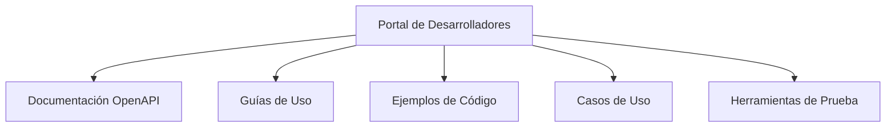


### 3.2 Versionamiento y Retrocompatibilidad

**Problema:** Ausencia de estrategia clara de versionamiento.

**Propuestas:**
1. **Adoptar Estrategia de Versionamiento por URI:**
   - Implementar versionamiento explícito en la URI (ej: `/api/v1/recursos`).
   - Configurar API Gateway para enrutar según versión.
   - Impacto: Permite evolucionar APIs sin romper consumidores.

2. **Implementar Deprecación Controlada:**
   - Establecer proceso formal para deprecación de versiones antiguas.
   - Notificar a consumidores con antelación.
   - Impacto: Reduce riesgo de cambios disruptivos.

**Ejemplo de Versionamiento:**
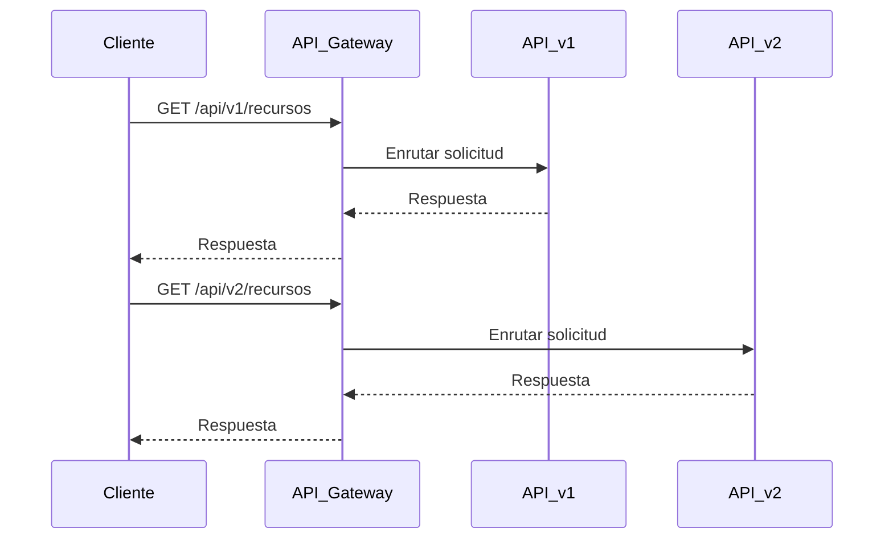


### 3.3 Seguridad y Gobernanza

**Problema:** Políticas de seguridad inconsistentes.

**Propuestas:**
1. **Implementar Validación Centralizada de Esquemas:**
   - Configurar API Gateway para validar payloads contra esquemas OpenAPI.
   - Herramientas: Kong, Apigee, AWS API Gateway.
   - Impacto: Reduce errores por datos inválidos.

2. **Establecer Políticas de Autenticación y Autorización:**
   - Implementar sistema centralizado con OAuth 2.0 y OpenID Connect.
   - Herramientas: Keycloak, Auth0, AWS Cognito.
   - Impacto: Mejora seguridad y gestión de accesos.

**Ejemplo de Flujo de Autenticación:**
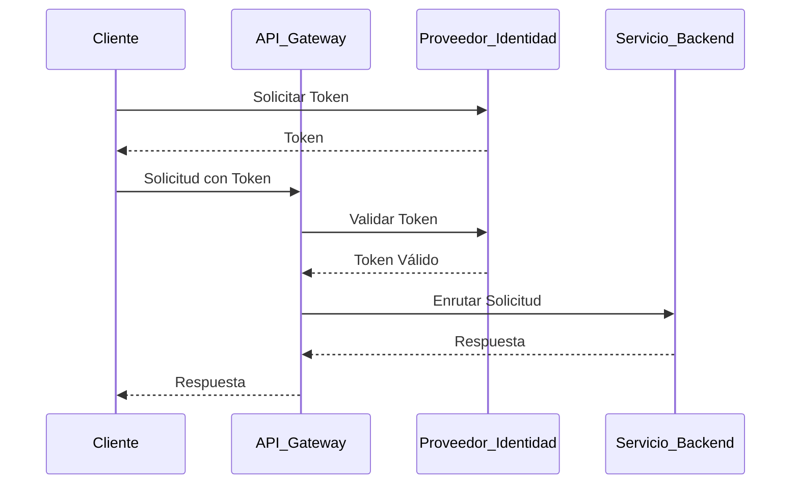


### 3.4 Rendimiento y Escalabilidad

**Problema:** Falta de métricas consistentes y estrategias de caching.

**Propuestas:**
1. **Implementar Caching Estratégico:**
   - Identificar APIs con patrones de solo lectura y alta demanda.
   - Configurar caching en API Gateway o capa de servicio.
   - Impacto: Reduce latencia y carga en sistemas backend.

2. **Establecer Métricas de Rendimiento:**
   - Implementar monitoreo continuo de latencia, throughput y tasa de errores.
   - Herramientas: Prometheus, Grafana, ELK.
   - Impacto: Detecta y resuelve problemas proactivamente.

**Ejemplo de Dashboard de Rendimiento:**
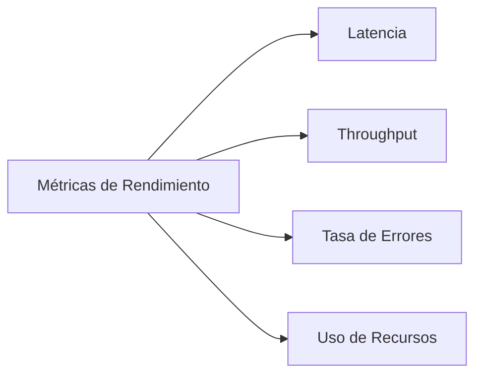


### 3.5 Gobernanza y Observabilidad

**Problema:** Falta de visibilidad sobre uso y estado de APIs.

**Propuestas:**
1. **Implementar Monitoreo de Uso de APIs:**
   - Configurar herramientas para monitorear uso, consumidores y errores.
   - Herramientas: AWS CloudWatch, ELK, Prometheus.
   - Impacto: Proporciona visibilidad sobre uso real.

2. **Establecer Proceso de Gobernanza de APIs:**
   - Definir proceso formal para gestión del ciclo de vida.
   - Asignar dueños para cada API.
   - Impacto: Asegura cumplimiento de estándares de calidad.

**Ejemplo de Ciclo de Vida de APIs:**
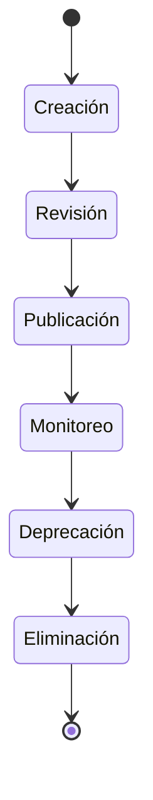


## 4. Priorización y Roadmap

**Matriz de Priorización:**
| Propuesta                                      | Impacto | Factibilidad | Costo | Plazo | Puntuación |
|------------------------------------------------|---------|--------------|-------|-------|------------|
| Establecer Proceso de Actualización            | Alto    | Alta         | Bajo  | 3     | 8.7        |
| Implementar Validación Centralizada            | Alto    | Alta         | Medio | 3     | 8.5        |
| Establecer Métricas de Rendimiento             | Alto    | Alta         | Medio | 3     | 8.5        |
| Implementar Portal de Desarrolladores          | Alto    | Alta         | Medio | 4     | 8.2        |
| Establecer Políticas de Autenticación          | Alto    | Alta         | Medio | 5     | 8.0        |

**Roadmap:**
- **Fase 1 (Semanas 1-3):**
  - Proceso de actualización de documentación.
  - Validación centralizada de esquemas.
  - Métricas de rendimiento.
- **Fase 2 (Semanas 4-8):**
  - Portal de desarrolladores.
  - Políticas de autenticación.
- **Fase 3 (Semanas 9-14):**
  - Versionamiento por URI.
  - Proceso de gobernanza.


## 5. Métricas de Éxito

| Métrica                                      | Objetivo                     |
|---------------------------------------------|------------------------------|
| APIs con documentación actualizada          | 100%                         |
| Tiempo de onboarding de nuevos desarrolladores | < 2 días               |
| Solicitudes rechazadas por validación       | < 1%                         |
| Tiempo de respuesta de APIs críticas        | < 200 ms                     |
| APIs con autenticación centralizada         | 100%                         |
| Incidentes de seguridad reportados          | 0                            |
| APIs con métricas de rendimiento monitoreadas | 100%                     |


## 6. Preguntas y Discusión

**Temas para Discusión:**
- ¿Qué propuestas consideran más prioritarias y por qué?
- ¿Qué desafíos anticipan en la implementación de estas propuestas?
- ¿Qué recursos adicionales se necesitan para ejecutar el plan?
- ¿Cómo podemos asegurar la adopción de los nuevos procesos y herramientas?

**Cierre:**
- Agradecer a los participantes.
- Confirmar próximos pasos y responsables.
- Abrir canal para feedback posterior.

```
