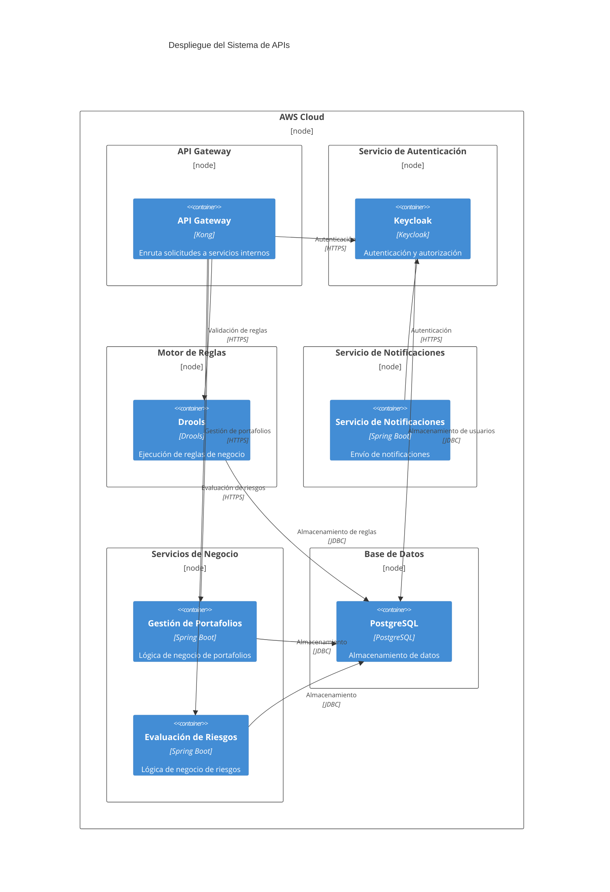
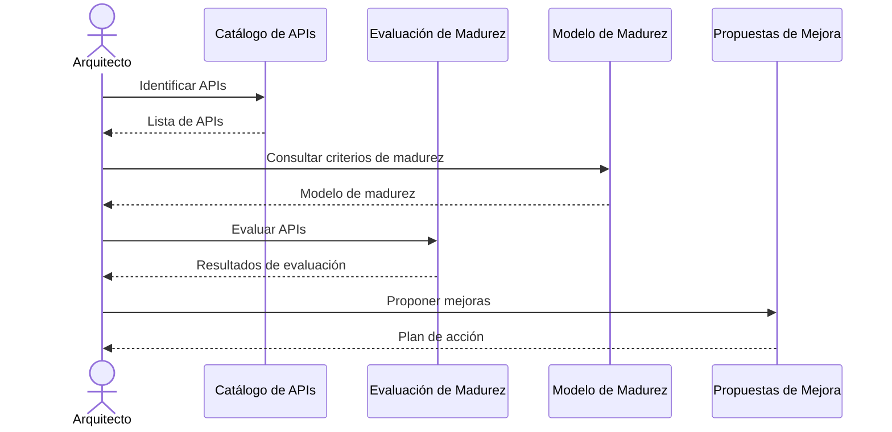
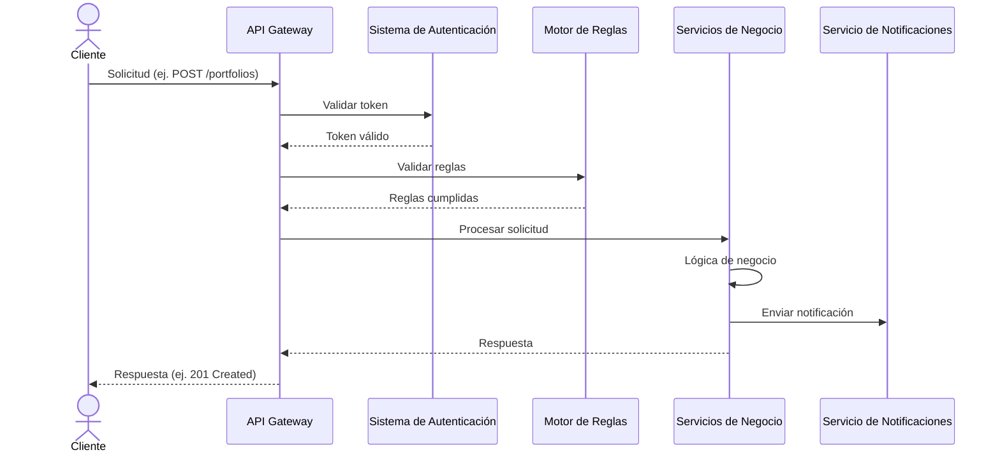

# Arquitectura del Sistema de APIs

## Vista de Componentes

El sistema de APIs de Pragma está compuesto por los siguientes componentes principales, cada uno con responsabilidades bien definidas:

### 1. **API Gateway**
- **Responsabilidad**: Punto de entrada para todas las solicitudes externas. Maneja el enrutamiento, autenticación, limitación de tasa y caching.
- **Dependencias**:
  - Sistema de Autenticación (Keycloak)
  - Motor de Reglas (Drools)
  - Servicios de Negocio (APIs internas)
- **Contratos**:
  - OpenAPI 3.1 (`contratos/openapi.yaml`)
  - Límites de tasa definidos en `atributos-de-calidad.md`.

### 2. **Sistema de Autenticación (Keycloak)**
- **Responsabilidad**: Gestionar la autenticación y autorización de usuarios y servicios.
- **Dependencias**:
  - Base de Datos de Usuarios
- **Contratos**:
  - OAuth 2.0 / OpenID Connect

### 3. **Motor de Reglas (Drools)**
- **Responsabilidad**: Ejecutar reglas de negocio dinámicas para validar solicitudes y determinar flujos.
- **Dependencias**:
  - Repositorio de Reglas
- **Contratos**:
  - API REST para ejecución de reglas

### 4. **Servicio de Notificaciones**
- **Responsabilidad**: Enviar notificaciones a usuarios y sistemas externos (email, SMS, webhooks).
- **Dependencias**:
  - Proveedores de Notificaciones (SendGrid, Twilio)
- **Contratos**:
  - API REST para envío de notificaciones

### 5. **Servicios de Negocio**
- **Responsabilidad**: Implementar la lógica de negocio específica de cada dominio (ej. Gestión de Portafolios, Evaluación de Riesgos).
- **Dependencias**:
  - Base de Datos de Negocio
  - Motor de Reglas
  - Servicio de Notificaciones
- **Contratos**:
  - OpenAPI 3.1 (`contratos/openapi.yaml`)

### 6. **Base de Datos**
- **Responsabilidad**: Almacenar datos de negocio, usuarios y reglas.
- **Dependencias**:
  - Ninguna
- **Contratos**:
  - Esquemas definidos en `contratos/openapi.yaml`

## Vista de Despliegue

## Límites y Contratos

### Límites entre Componentes

| **Componente Origen**       | **Componente Destino**      | **Contrato**                     | **Tipo de Comunicación** |
|------------------------------|------------------------------|-----------------------------------|--------------------------|
| API Gateway                  | Sistema de Autenticación     | OAuth 2.0 / OpenID Connect        | Síncrona (HTTPS)         |
| API Gateway                  | Motor de Reglas              | API REST                          | Síncrona (HTTPS)         |
| API Gateway                  | Servicios de Negocio         | OpenAPI 3.1                       | Síncrona (HTTPS)         |
| Servicios de Negocio         | Base de Datos                | JDBC                              | Síncrona                 |
| Servicios de Negocio         | Servicio de Notificaciones   | API REST                          | Asíncrona (Webhooks)     |
| Motor de Reglas              | Base de Datos                | JDBC                              | Síncrona                 |

### Contratos de APIs

Los contratos detallados de las APIs se encuentran en:
- `contratos/openapi.yaml`: Definición de endpoints, esquemas, ejemplos y versiones.
- `atributos-de-calidad.md`: Métricas y umbrales de calidad para cada API.

## Flujos Críticos

### Flujo 1: Evaluación de Madurez de APIs

### Flujo 2: Procesamiento de una Solicitud de API

## Decisiones Arquitectónicas Clave

1. **Uso de API Gateway**: Centralizar el enrutamiento, autenticación y limitación de tasa para todas las APIs externas.
2. **Modelo de Madurez de APIs**: Adoptar el modelo de Pragma para estandarizar la evaluación y mejora de APIs.
3. **Contratos OpenAPI**: Documentar todas las APIs con OpenAPI 3.1 para garantizar consistencia y compatibilidad.
4. **Despliegue en AWS**: Aprovechar la escalabilidad y servicios gestionados de AWS para el despliegue.

Para más detalles, consultar los ADRs en el directorio `adr/`.