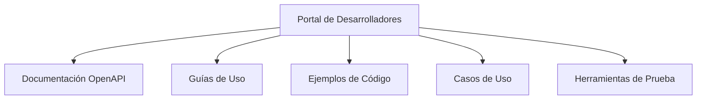
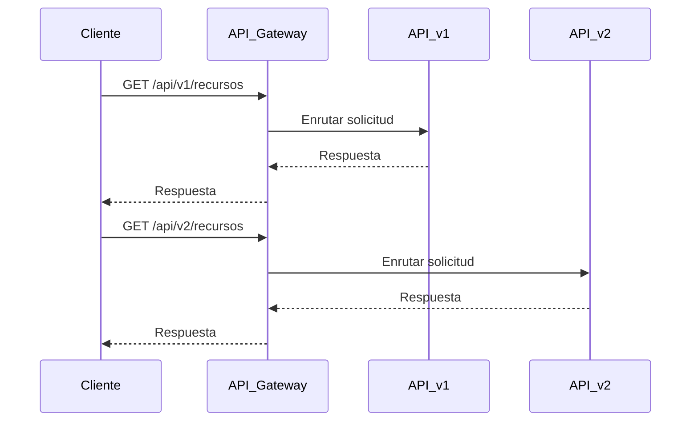
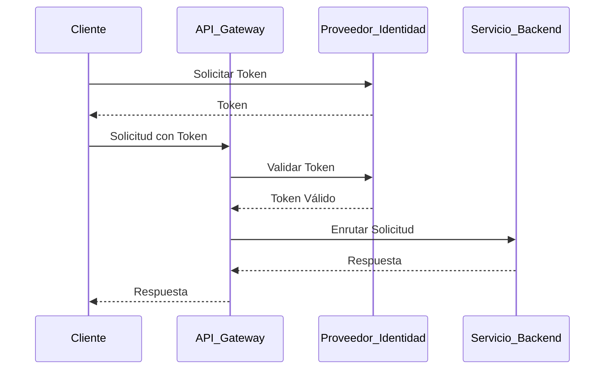
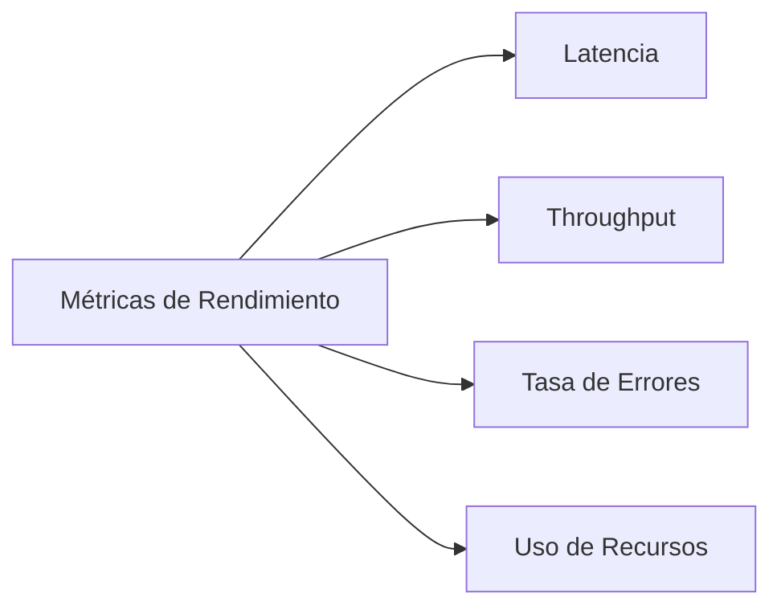
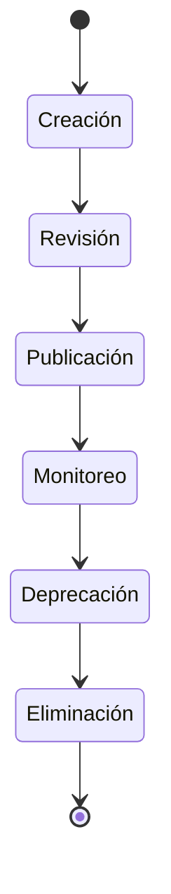

# Presentación: Propuestas de Mejora para las APIs de Pragma

## Introducción

**Objetivo de la Presentación:**
Presentar las propuestas de mejora para elevar el nivel de madurez de las APIs de Pragma, basadas en la evaluación realizada y alineadas con los objetivos estratégicos y los atributos de calidad definidos.

**Audiencia:**
- Equipo de Arquitectura
- Líderes de Equipo
- Dueños de Producto
- Equipo de Seguridad
- Equipo de DevOps

**Duración:** 30 minutos

## Agenda

1. **Contexto y Objetivos** (3 minutos)
2. **Evaluación Actual de Madurez** (5 minutos)
3. **Propuestas de Mejora** (15 minutos)
   - Documentación y Descubrimiento
   - Versionamiento y Retrocompatibilidad
   - Seguridad y Gobernanza
   - Rendimiento y Escalabilidad
   - Gobernanza y Observabilidad
4. **Priorización y Roadmap** (5 minutos)
5. **Métricas de Éxito** (2 minutos)
6. **Preguntas y Discusión** (5 minutos)

## 1. Contexto y Objetivos

**Contexto:**
- El sistema actual de APIs en Pragma presenta variaciones significativas en su nivel de madurez.
- Estas variaciones impactan en la consistencia, mantenibilidad, seguridad y escalabilidad de los servicios.
- La evaluación realizada identificó oportunidades de mejora en áreas clave como documentación, versionamiento, seguridad y rendimiento.

**Objetivos de la Mejora:**
- Elevar el nivel de madurez de las APIs según el modelo de Pragma.
- Mejorar la experiencia de los desarrolladores internos y externos.
- Reducir riesgos operativos y de seguridad.
- Asegurar que las APIs cumplan con los estándares de calidad y rendimiento.

## 2. Evaluación Actual de Madurez

**Modelo de Madurez de APIs de Pragma:**
El modelo evalúa las APIs en cinco dimensiones:
- **Documentación:** Claridad, completitud y accesibilidad.
- **Versionamiento:** Estrategia y soporte para múltiples versiones.
- **Seguridad:** Autenticación, autorización y validación.
- **Rendimiento:** Latencia, throughput y escalabilidad.
- **Gobernanza:** Ciclo de vida, monitoreo y observabilidad.

**Resultados de la Evaluación:**
| Dimensión          | Nivel Promedio | Observaciones                                                                 |
|--------------------|-----------------|-------------------------------------------------------------------------------|
| Documentación      | 2.1             | Documentación desactualizada o incompleta en varias APIs críticas.           |
| Versionamiento     | 1.8             | Ausencia de estrategia clara de versionamiento en varias APIs.               |
| Seguridad          | 2.5             | Inconsistencias en autenticación y autorización.                             |
| Rendimiento        | 2.3             | Falta de métricas consistentes y estrategias de caching.                     |
| Gobernanza         | 1.9             | Falta de procesos formales para gestión del ciclo de vida y monitoreo de uso.|

**Principales Hallazgos:**
- Falta de documentación estandarizada y accesible.
- Ausencia de estrategia clara de versionamiento.
- Políticas de seguridad inconsistentes.
- Falta de visibilidad sobre el uso y rendimiento de las APIs.

## 3. Propuestas de Mejora

### 3.1 Documentación y Descubrimiento

**Problema:** Falta de documentación estandarizada y accesible.

**Propuestas:**
1. **Implementar un Portal de Desarrolladores:**
   - Crear un portal centralizado con documentación, ejemplos y casos de uso.
   - Herramientas: Backstage, SwaggerHub, Redocly.
   - Impacto: Reduce tiempo de onboarding y mejora adopción.

2. **Establecer Proceso de Actualización de Documentación:**
   - Definir proceso obligatorio para actualizar documentación con cada cambio en contratos.
   - Integrar en CI/CD para validar cambios en documentación.
   - Impacto: Asegura documentación alineada con implementación.

**Ejemplo de Portal de Desarrolladores:**

### 3.2 Versionamiento y Retrocompatibilidad

**Problema:** Ausencia de estrategia clara de versionamiento.

**Propuestas:**
1. **Adoptar Estrategia de Versionamiento por URI:**
   - Implementar versionamiento explícito en la URI (ej: `/api/v1/recursos`).
   - Configurar API Gateway para enrutar según versión.
   - Impacto: Permite evolucionar APIs sin romper consumidores.

2. **Implementar Deprecación Controlada:**
   - Establecer proceso formal para deprecación de versiones antiguas.
   - Notificar a consumidores con antelación.
   - Impacto: Reduce riesgo de cambios disruptivos.

**Ejemplo de Versionamiento:**

### 3.3 Seguridad y Gobernanza

**Problema:** Políticas de seguridad inconsistentes.

**Propuestas:**
1. **Implementar Validación Centralizada de Esquemas:**
   - Configurar API Gateway para validar payloads contra esquemas OpenAPI.
   - Herramientas: Kong, Apigee, AWS API Gateway.
   - Impacto: Reduce errores por datos inválidos.

2. **Establecer Políticas de Autenticación y Autorización:**
   - Implementar sistema centralizado con OAuth 2.0 y OpenID Connect.
   - Herramientas: Keycloak, Auth0, AWS Cognito.
   - Impacto: Mejora seguridad y gestión de accesos.

**Ejemplo de Flujo de Autenticación:**

### 3.4 Rendimiento y Escalabilidad

**Problema:** Falta de métricas consistentes y estrategias de caching.

**Propuestas:**
1. **Implementar Caching Estratégico:**
   - Identificar APIs con patrones de solo lectura y alta demanda.
   - Configurar caching en API Gateway o capa de servicio.
   - Impacto: Reduce latencia y carga en sistemas backend.

2. **Establecer Métricas de Rendimiento:**
   - Implementar monitoreo continuo de latencia, throughput y tasa de errores.
   - Herramientas: Prometheus, Grafana, ELK.
   - Impacto: Detecta y resuelve problemas proactivamente.

**Ejemplo de Dashboard de Rendimiento:**

### 3.5 Gobernanza y Observabilidad

**Problema:** Falta de visibilidad sobre uso y estado de APIs.

**Propuestas:**
1. **Implementar Monitoreo de Uso de APIs:**
   - Configurar herramientas para monitorear uso, consumidores y errores.
   - Herramientas: AWS CloudWatch, ELK, Prometheus.
   - Impacto: Proporciona visibilidad sobre uso real.

2. **Establecer Proceso de Gobernanza de APIs:**
   - Definir proceso formal para gestión del ciclo de vida.
   - Asignar dueños para cada API.
   - Impacto: Asegura cumplimiento de estándares de calidad.

**Ejemplo de Ciclo de Vida de APIs:**

## 4. Priorización y Roadmap

**Matriz de Priorización:**
| Propuesta                                      | Impacto | Factibilidad | Costo | Plazo | Puntuación |
|------------------------------------------------|---------|--------------|-------|-------|------------|
| Establecer Proceso de Actualización            | Alto    | Alta         | Bajo  | 3     | 8.7        |
| Implementar Validación Centralizada            | Alto    | Alta         | Medio | 3     | 8.5        |
| Establecer Métricas de Rendimiento             | Alto    | Alta         | Medio | 3     | 8.5        |
| Implementar Portal de Desarrolladores          | Alto    | Alta         | Medio | 4     | 8.2        |
| Establecer Políticas de Autenticación          | Alto    | Alta         | Medio | 5     | 8.0        |

**Roadmap:**
- **Fase 1 (Semanas 1-3):**
  - Proceso de actualización de documentación.
  - Validación centralizada de esquemas.
  - Métricas de rendimiento.
- **Fase 2 (Semanas 4-8):**
  - Portal de desarrolladores.
  - Políticas de autenticación.
- **Fase 3 (Semanas 9-14):**
  - Versionamiento por URI.
  - Proceso de gobernanza.

## 5. Métricas de Éxito

| Métrica                                      | Objetivo                     |
|---------------------------------------------|------------------------------|
| APIs con documentación actualizada          | 100%                         |
| Tiempo de onboarding de nuevos desarrolladores | < 2 días               |
| Solicitudes rechazadas por validación       | < 1%                         |
| Tiempo de respuesta de APIs críticas        | < 200 ms                     |
| APIs con autenticación centralizada         | 100%                         |
| Incidentes de seguridad reportados          | 0                            |
| APIs con métricas de rendimiento monitoreadas | 100%                     |

## 6. Preguntas y Discusión

**Temas para Discusión:**
- ¿Qué propuestas consideran más prioritarias y por qué?
- ¿Qué desafíos anticipan en la implementación de estas propuestas?
- ¿Qué recursos adicionales se necesitan para ejecutar el plan?
- ¿Cómo podemos asegurar la adopción de los nuevos procesos y herramientas?

**Cierre:**
- Agradecer a los participantes.
- Confirmar próximos pasos y responsables.
- Abrir canal para feedback posterior.